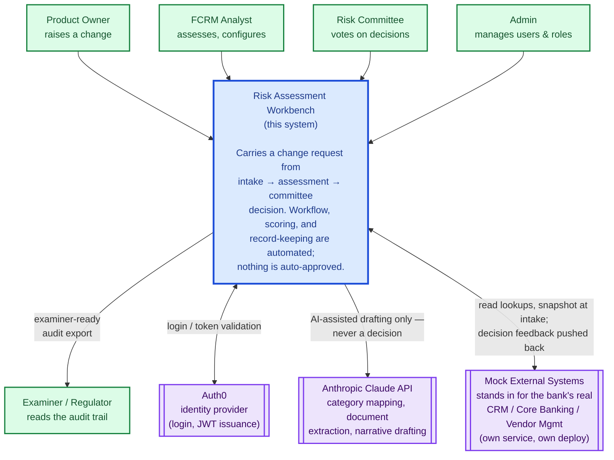
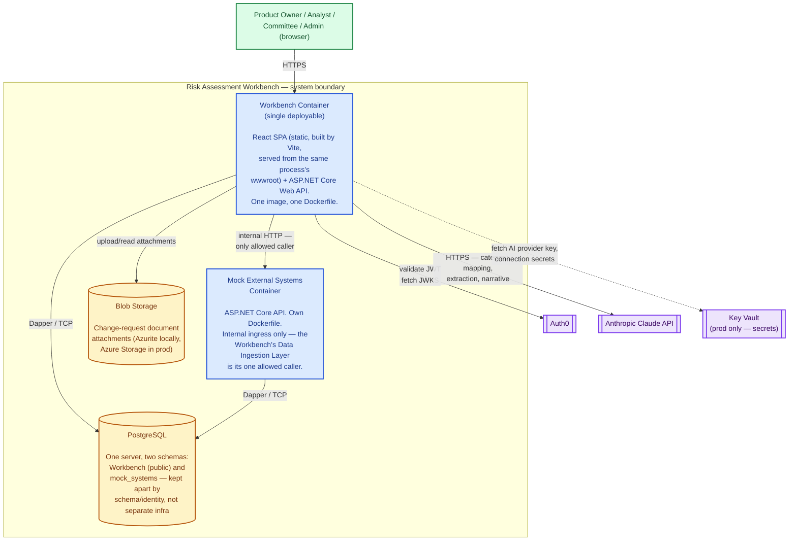
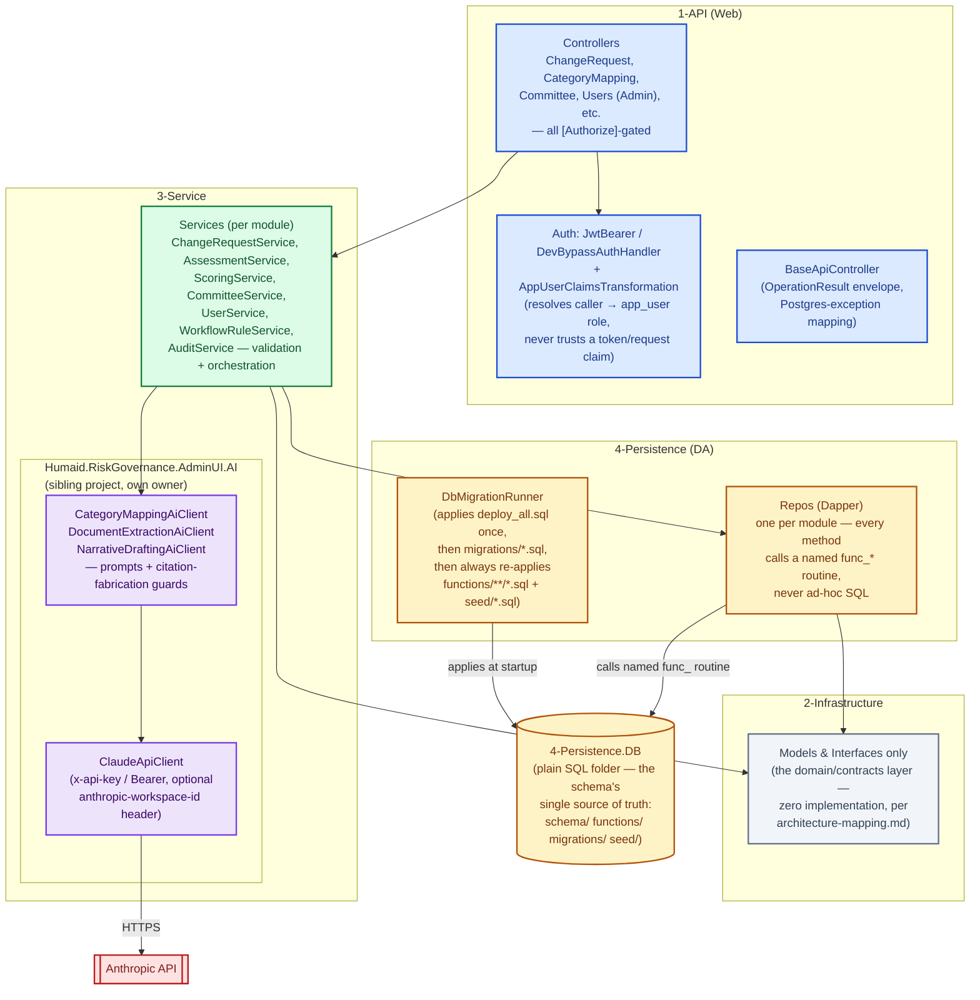
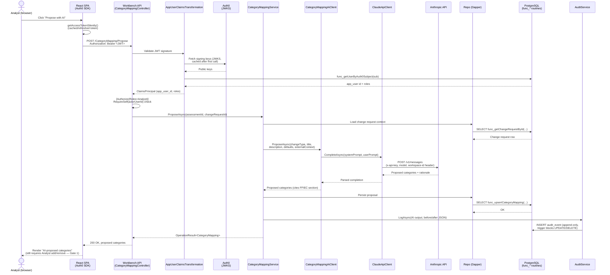
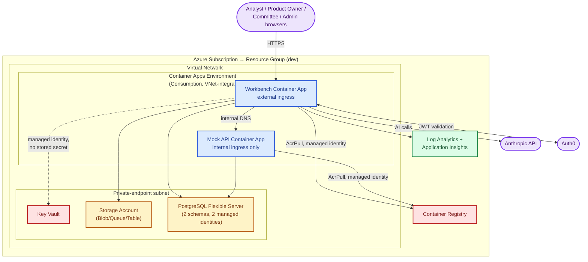

# System Architecture Diagrams (C4 Model) — Risk Assessment Workbench

The C4 model describes a system at four zoom levels — System Context, Container, Component, and
(often paired with) Code — plus two companion view types that cut across those levels: a Sequence
diagram for a specific request flow, and a Deployment diagram for physical/cloud topology. This
document works through all five for the Risk Assessment Workbench, grounded in what's actually
built and running, not an aspirational target.

**How this relates to the repo's other architecture docs** (don't duplicate, cross-reference):
[`architecture-mapping.md`](architecture-mapping.md) explains the layering *decisions* (why Dapper
not EF Core, why `2-Infrastructure` plays the "domain" role); [`ecosystem-diagram.md`](ecosystem-diagram.md)
covers the *business/data* ecosystem (who submits what, which steps are AI vs. deterministic vs.
human, the human-in-the-loop gates); [`infrastructure-architecture-mapping.md`](infrastructure-architecture-mapping.md)
is the authoritative Azure Terraform mapping. This document is the connective tissue between them,
organized the way a new engineer or a non-technical stakeholder would actually zoom in.

---

## 1. System Context Diagram (Level 1)

Who uses the Workbench, and what it talks to outside its own boundary. For a non-technical
stakeholder: everything inside the shaded box is "the system we built"; everything outside it is
either a person or someone else's service.



**Notes on what's "external" here and why:** Mock External Systems is code we wrote ourselves, but
it's architecturally external to the Workbench by deliberate design (per `CLAUDE.md` and Epic 14) —
its own separately-deployed service, own database schema, reachable only through the Workbench's
Data Ingestion Layer, standing in for systems a real bank would already own. Anthropic is the only
AI provider actually wired up today; `AI_PROVIDER=AzureFoundry` exists as a switch in code but no
Azure AI Foundry project has been provisioned (see `infrastructure-architecture-mapping.md` §2).
Auth0 issues and signs the JWTs the Workbench validates on every request — nothing about a caller's
identity or role is ever trusted from the request itself.

---

## 2. Container Diagram (Level 2)

Inside the system boundary: the separately deployable units, and how they talk to each other. Each
box here is something that gets its own Docker image and its own `docker compose`/Container App
entry — not a code-level module (that's Level 3, below).



**A deliberate simplification worth stating explicitly:** the React SPA is not its own container —
it's built at `docker build` time (Vite) and baked into the same image's `wwwroot`, served by the
same ASP.NET Core process that serves the API (see the Workbench `Dockerfile`'s `webapp-build`
stage). One process, one port, one deployable unit. This keeps local dev and the Azure Container App
topology identical — the same image runs in both places.

---

## 3. Component Diagram (Level 3)

Zooming into the Workbench container's own internals: the 5-layer Clean Architecture this repo
already used before the hackathon brief arrived (see `architecture-mapping.md` for why it wasn't
restructured to match `CLAUDE.md`'s suggested `RAW.*` naming).



**Boundary worth calling out:** `2-Infrastructure` holds only models and interfaces — no
implementation — which is exactly the role `CLAUDE.md`'s `RAW.Domain` would play. Every controller
action depends on a service *interface*; every service depends on a repo *interface*; the concrete
`UserRepo`/`ChangeRequestRepo`/etc. classes are wired in only at `Program.cs`'s composition root.
This is what makes the unit-test suite (103 tests as of this session) able to mock every layer
cleanly.

---

## 4. Sequence Diagram — "Propose with AI" (a real, recently-exercised request)

Rather than a generic example, this is the actual request/response path for
`POST /api/CategoryMapping/Propose` (Epic 2) — chosen because this exact flow was diagnosed and
fixed end-to-end earlier in this project's life (an Auth0 JWT-validation issue, then an Anthropic
credential issue), so every hop below is verified against real logs, not assumed.



**Failure modes actually seen on this exact path this session**, kept here because they're part of
what makes this an honest sequence diagram rather than a happy-path fiction: a 401 at the
`AppUserClaimsTransformation` step when the JWT's signing key couldn't be validated (a corporate
TLS-inspecting proxy breaking the container's JWKS fetch — fixed by trusting the proxy's root CA in
the runtime image, not just the build image); and a clean, authenticated 401 straight from
Anthropic (`"API key is invalid"` / `"credit balance too low"`) when the configured key was wrong or
the account lacked credit — both surfaced correctly *because* `ClaudeApiClient` logs the real
provider response rather than swallowing it.

---

## 5. Deployment Diagram

Two views, because both are real and currently in use: the Azure target (what Terraform in
`iac/environments/dev` actually provisions) and the local Docker Compose stack (what every
contributor, including this session, develops and tests against day to day).

### 5a. Azure (target / dev environment)



*Network/security posture (see `infrastructure-architecture-mapping.md` §4 for the full detail):*
Key Vault, Storage, and PostgreSQL sit behind private endpoints with a firewall allow-list as the
out-of-band path; both container apps authenticate to Azure resources via managed identity, never a
stored credential; only the Workbench has external ingress.

### 5b. Local development (what this repo's `ops/` actually runs)

```mermaid
flowchart TB
    classDef host fill:#f1f5f9,stroke:#64748b,color:#334155,stroke-width:2px
    classDef container fill:#dbeafe,stroke:#1d4ed8,color:#1e3a8a,stroke-width:2px
    classDef data fill:#fef3c7,stroke:#b45309,color:#78350f,stroke-width:2px
    classDef external fill:#ede4fc,stroke:#7c3aed,color:#3b0764,stroke-width:2px

    DEV(["Developer browser<br/>localhost:3000"]):::host

    subgraph MACHINE["Developer machine"]
        subgraph DOCKERNET["Docker network (ops_default)"]
            WEBAPP["webapp<br/>vite preview :4173→3000<br/>(static SPA only)"]:::container
            WORKBENCH["workbench<br/>ASP.NET Core :8080→5210<br/>+ SPA served for prod-mode<br/>tests via wwwroot"]:::container
            MOCKAPI["mockapi<br/>ASP.NET Core :8080→5220"]:::container
            POSTGRES[("postgres:16<br/>:5432→5433")]:::data
            AZURITE[("azurite<br/>blob :10000<br/>(local Blob Storage stand-in)")]:::data
        end
    end

    AUTH0EXT(["Auth0"]):::external
    ANTHROPICEXT(["Anthropic API"]):::external
    PROXY{{"Corporate TLS-inspecting<br/>proxy (if present) —<br/>root CA trusted via<br/>ops/certs/, both build<br/>AND runtime image stages"}}:::external

    DEV --> WEBAPP
    WEBAPP -->|VITE_API_BASE_URL| WORKBENCH
    WORKBENCH --> POSTGRES
    WORKBENCH --> AZURITE
    WORKBENCH -->|internal, only<br/>allowed caller| MOCKAPI
    MOCKAPI --> POSTGRES
    WORKBENCH -.->|DNS: 8.8.8.8, 1.1.1.1<br/>(host VPN DNS bypass)| AUTH0EXT
    WORKBENCH -.-> PROXY -.-> AUTH0EXT
    PROXY -.-> ANTHROPICEXT
```

**Two infrastructure lessons baked into this diagram, both hit and fixed during actual local
testing:** the `workbench` and `mockapi` services carry an explicit DNS override
(`8.8.8.8`/`1.1.1.1`) because a corporate VPN client can reconfigure host DNS in a way that doesn't
propagate correctly into Docker's network; and both Dockerfiles trust an optional local corporate
root CA (`ops/certs/`, gitignored) in **both** the build stage (so `dotnet restore` works) and the
runtime stage (so the running app's own outbound calls to Auth0's JWKS endpoint and the Anthropic
API pass TLS validation) — a distinction that isn't obvious until you hit "the signature key was
not found" on a JWT that's actually valid.

---

## Revision log

- **2026-09-30** — initial version. Written after this session's live debugging of the exact
  Auth0/JWKS and Anthropic-key failures the Sequence and Deployment diagrams above document,
  so both are grounded in real, observed request/response data rather than a clean-room design.
