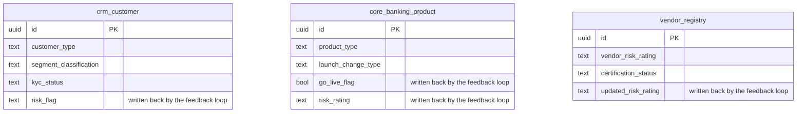

# Database Schema Diagram — Risk Assessment Workbench

**Source of truth:** [`src/4-Persistence/Humaid.RiskGovernance.AdminUI.DB/schema/`](../../src/4-Persistence/Humaid.RiskGovernance.AdminUI.DB/schema/) (the Workbench's own database) and [`src/6-MockExternalSystems/Humaid.RiskGovernance.MockSystems/db/schema.sql`](../../src/6-MockExternalSystems/Humaid.RiskGovernance.MockSystems/db/schema.sql) (Mock Systems). This diagram is generated by reading those files directly — if it and the SQL ever disagree, the SQL wins; re-derive this doc from it rather than editing the two out of sync.

**Status:** current as of 2026-09-25, against `release/1.00`.

---

## 1. Two databases, not one

Mock External Systems runs in its own Postgres **schema namespace** (`mock_systems`, not `public`) precisely so it is not part of the Workbench's own schema — see [`architecture-mapping.md`](architecture-mapping.md). There is **no foreign key** from either side crossing that boundary: `change_request_external_snapshot` (§3 below) carries `mock_customer_id`/`mock_product_id`/`mock_vendor_id` as plain `UUID` columns, not `REFERENCES`, because the only sanctioned path between the two is the Data Ingestion Layer's HTTP call, never a shared connection or a cross-schema FK (Epic 14). The two ER diagrams below are deliberately separate for the same reason.

---

## 2. Workbench schema (23 tables, `public`)

```mermaid
erDiagram
    app_user {
        uuid id PK
        text role "ProductOwner | Analyst | CommitteeMember | Admin"
    }

    risk_framework {
        uuid id PK
        text name UK
        text citation_source
    }

    risk_category {
        uuid id PK
        uuid risk_framework_id FK
        text code
        text citation_section
    }

    risk_subfactor {
        uuid id PK
        uuid risk_category_id FK
        text name
    }

    change_request_type_category_map {
        uuid id PK
        text change_type
        uuid risk_category_id FK
        text weight "Primary | Secondary"
    }

    change_request {
        uuid id PK
        text request_number UK
        text change_type
        text status
        uuid submitted_by_user_id FK
    }

    change_request_attachment {
        uuid id PK
        uuid change_request_id FK
        text content_type
        int version_number
        uuid superseded_by_attachment_id FK "self-reference"
        uuid uploaded_by_user_id FK
    }

    change_request_clarification {
        uuid id PK
        uuid change_request_id FK
        uuid requested_by_user_id FK
        text status "Open | Answered"
    }

    change_request_external_snapshot {
        uuid id PK
        uuid change_request_id FK "UK - 1:1, immutable"
        uuid mock_customer_id "no FK - crosses into Mock Systems"
        uuid mock_product_id "no FK"
        uuid mock_vendor_id "no FK"
    }

    assessment {
        uuid id PK
        uuid change_request_id FK "UK - 1:1"
        text status "Draft | Finalized"
        uuid scoring_config_version_id FK
        uuid finalized_by_user_id FK
    }

    assessment_category_mapping {
        uuid id PK
        uuid assessment_id FK
        uuid risk_category_id FK
        text source "AiProposed | AnalystAdded"
        uuid created_by_user_id FK
    }

    policy_document {
        uuid id PK
        uuid risk_framework_id FK
        text title
        text version_label
    }

    policy_chunk {
        uuid id PK
        uuid policy_document_id FK
        uuid risk_category_id FK
        text section_ref
    }

    assessment_policy_reliance {
        uuid id PK
        uuid assessment_id FK
        uuid risk_category_id FK
        uuid policy_chunk_id FK
        text decision "ReliedUpon | NotRelevant"
        uuid decided_by_user_id FK
    }

    extracted_field {
        uuid id PK
        uuid change_request_id FK
        uuid attachment_id FK
        text field_key
        text source "AiExtracted | AnalystCorrected"
        uuid updated_by_user_id FK
    }

    assessment_narrative_section {
        uuid id PK
        uuid assessment_id FK
        uuid risk_category_id FK
        text status "AiDrafted | AnalystReviewed | AnalystEdited"
        uuid updated_by_user_id FK
    }

    control {
        uuid id PK
        uuid risk_category_id FK
        text name
    }

    scoring_config {
        uuid id PK
        uuid risk_category_id FK
        numeric max_mitigation_factor "< 1.0, enforced"
        bool is_active
        uuid created_by_user_id FK
    }

    assessment_risk_score {
        uuid id PK
        uuid assessment_id FK
        uuid risk_category_id FK
        numeric inherent_rating
        numeric residual_rating "> 0, enforced"
        bool is_override
        uuid created_by_user_id FK
    }

    committee_vote {
        uuid id PK
        uuid assessment_id FK
        uuid committee_member_user_id FK
        text vote "Approve | Reject | Defer | ApproveWithConditions"
    }

    committee_decision {
        uuid id PK
        uuid assessment_id FK "UK - 1:1"
        text resolution
    }

    workflow_rule {
        uuid id PK
        text rule_key
        jsonb rule_value
        uuid created_by_user_id FK
    }

    audit_event {
        uuid id PK
        uuid change_request_id FK
        uuid assessment_id FK
        text entity_type
        text action
        uuid actor_user_id FK "null = system/AI"
    }

    %% --- Epic 2: framework hierarchy ---
    risk_framework ||--o{ risk_category : "has"
    risk_category ||--o{ risk_subfactor : "has"
    risk_category ||--o{ change_request_type_category_map : "maps to"

    %% --- Epic 1: intake ---
    app_user ||--o{ change_request : "submits"
    change_request ||--o{ change_request_attachment : "has"
    change_request_attachment ||--o{ change_request_attachment : "supersedes"
    app_user ||--o{ change_request_attachment : "uploads"
    change_request ||--o{ change_request_clarification : "has"
    app_user ||--o{ change_request_clarification : "requests"

    %% --- Epic 14: external snapshot (immutable, 1:1) ---
    change_request ||--|| change_request_external_snapshot : "ingests"

    %% --- Assessment core (1:1 with change_request) ---
    change_request ||--|| assessment : "is assessed by"
    app_user ||--o{ assessment : "finalizes"
    scoring_config ||--o{ assessment : "active config for"

    %% --- Epic 2: category mapping ---
    assessment ||--o{ assessment_category_mapping : "has"
    risk_category ||--o{ assessment_category_mapping : "mapped via"
    app_user ||--o{ assessment_category_mapping : "adds"

    %% --- Epic 3: policy research ---
    risk_framework ||--o{ policy_document : "sources"
    policy_document ||--o{ policy_chunk : "chunked into"
    risk_category ||--o{ policy_chunk : "relevant to"
    assessment ||--o{ assessment_policy_reliance : "relies on"
    risk_category ||--o{ assessment_policy_reliance : "for category"
    policy_chunk ||--o{ assessment_policy_reliance : "cited by"
    app_user ||--o{ assessment_policy_reliance : "decides"

    %% --- Epic 4: document extraction ---
    change_request ||--o{ extracted_field : "yields"
    change_request_attachment ||--o{ extracted_field : "extracted from"
    app_user ||--o{ extracted_field : "corrects"

    %% --- Epic 5: narrative ---
    assessment ||--o{ assessment_narrative_section : "has"
    risk_category ||--o{ assessment_narrative_section : "per category"
    app_user ||--o{ assessment_narrative_section : "edits"

    %% --- Epic 7 + 10: scoring ---
    risk_category ||--o{ control : "mitigated by"
    risk_category ||--o{ scoring_config : "configured for"
    app_user ||--o{ scoring_config : "sets"
    assessment ||--o{ assessment_risk_score : "scored via"
    risk_category ||--o{ assessment_risk_score : "per category"
    app_user ||--o{ assessment_risk_score : "overrides"

    %% --- Epic 8: committee ---
    assessment ||--o{ committee_vote : "voted on by"
    app_user ||--o{ committee_vote : "casts"
    assessment ||--|| committee_decision : "resolves to"

    %% --- Epic 10: workflow config ---
    app_user ||--o{ workflow_rule : "sets"

    %% --- Epic 9: audit (references, never cascades) ---
    change_request ||--o{ audit_event : "logs"
    assessment ||--o{ audit_event : "logs"
    app_user ||--o{ audit_event : "acts in"
```

A few things worth reading off this diagram rather than just the raw SQL:

- **`app_user` is the hub.** Every human-attributable action in every epic — submit, upload, add a category, correct a field, edit a narrative, score, override, vote, configure — carries a `..._user_id` FK back to it. That fan-out *is* US-6.x's "override is never anonymous" rule, visible structurally rather than just as a convention.
- **`risk_category` is the second hub**, tying the FFIEC framework (§Epic 2) to every downstream artifact that must be traceable to a specific category: policy chunks, narrative sections, controls, scoring config, risk scores. This is what makes "why was this category scored this way, citing what policy" answerable with joins, not application logic.
- **Three 1:1 relationships**, each enforced by a `UNIQUE` FK rather than a separate join table: `change_request ↔ assessment` (the request is "what was asked," the assessment is "how FCRM decided," per `005_assessments.sql`'s own comment), `change_request ↔ change_request_external_snapshot` (exactly zero or one snapshot, ever — US-14.4's immutability), and `assessment ↔ committee_decision` (one resolved outcome per assessment).
- **`change_request_attachment` self-references** (`superseded_by_attachment_id`) — replacing a document is a new row + version number, never an overwrite (US-1.2), the same append-don't-mutate pattern `audit_event`'s trigger enforces at the whole-table level.
- **`audit_event`'s FKs are deliberately loose** (`change_request_id`/`assessment_id`/`actor_user_id` are all nullable) because it's an append-only log referencing *whatever entity the event was about*, not a child record that must always belong to exactly one parent the way `assessment_category_mapping` does.
- **`scoring_config` points at `assessment`, not the other way first** — `assessment.scoring_config_version_id` is added by an `ALTER TABLE` in `010_scoring.sql` specifically to avoid a forward reference in `005_assessments.sql`, so an assessment keeps scoring against whichever config version was active when it started even if the config changes later (US-10.1's versioning rule).

---

## 3. Mock Systems schema (3 tables, `mock_systems`)

No FKs between these three — each is an independent mock domain (CRM, Core Banking, Vendor Management), standing in for three systems a real bank would already have. The `risk_flag`/`go_live_flag`/`risk_rating`/`updated_risk_rating` columns are the *inbound* side of Epic 14's feedback loop: `CommitteeService` (Workbench) calls this service's `POST /api/{resource}/{id}/risk-flag` after a decision, and this service writes the result into these columns directly — the Workbench never has a connection string into `mock_systems`, only this HTTP path.

---

## Revision log

| Date | Change |
|---|---|
| 2026-09-25 | Initial version, generated from `release/1.00`'s schema files. |
