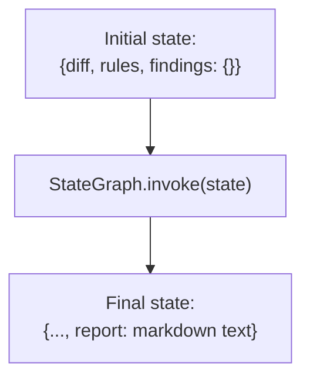
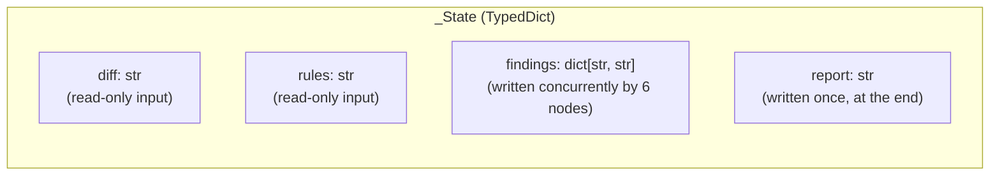
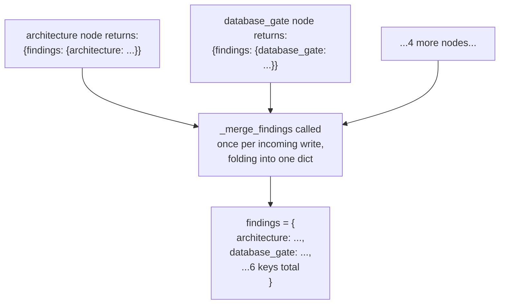
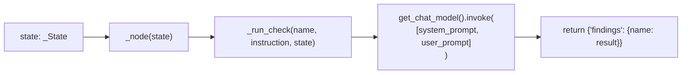
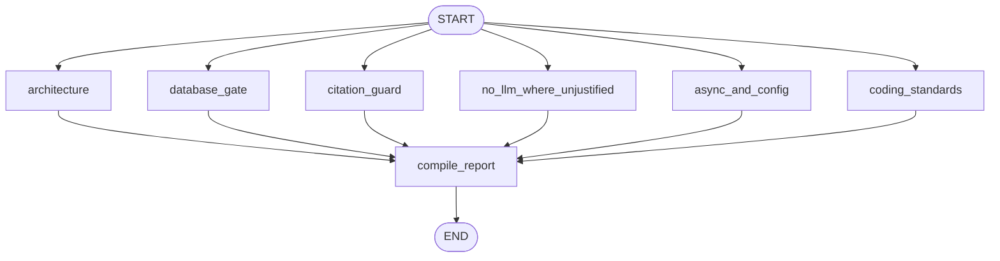
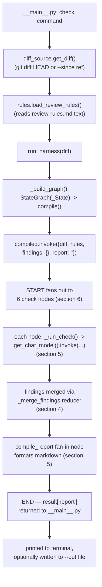

# Dev Harness — Technical Deep Dive (LangGraph Implementation)

**Location of the tool itself:** `harness/dev_harness/`
**Status:** Working, local-only, on-demand (no CI integration yet)
**Related:** [`harness/README.md`](../../harness/README.md) · [`dev-harness.md`](dev-harness.md) (the
high-level/non-technical explainer this document expands on) · [`ba-harness.md`](ba-harness.md)
(sibling harness, same documentation format) · [`langgraph-integration.md`](langgraph-integration.md)
(the *product* LangGraph service — unrelated at runtime)

---

## 1. What this document covers

The companion document [`dev-harness.md`](dev-harness.md) explains *what* the dev harness is and
*why* it exists, in plain language. This document is the technical counterpart: it walks through
**every core LangGraph primitive** and shows exactly where it appears (or deliberately does not
appear) in `harness/dev_harness/graph.py`. If you're about to modify the graph, add a check, or
wire in a new LangGraph feature, this is the reference to read first.

LangGraph graphs are built from a small, fixed set of building blocks. This document covers each
one in turn:

| Primitive | Used here? |
|---|---|
| State (`TypedDict` / schema) | Yes |
| Reducers (`Annotated[...]`) | Yes — required for concurrent fan-out writes |
| Nodes | Yes — six check nodes + one compile node |
| Normal edges | Yes — every edge in this graph |
| Conditional edges | No — candidate fast-follow |
| `StateGraph` / `START` / `END` | Yes |
| `.compile()` / `.invoke()` | Yes |
| Tools / `ToolNode` | No |
| Checkpointers / persistence | No |
| Subgraphs | No |
| Streaming (`.stream()`) | No — `.invoke()` only |

---

## 2. The idea in one sentence

A single `StateGraph` fans a `git diff` out to six independent, single-concern review nodes that
each call the same chat model with a narrow instruction, then fans back in to one node that
merges their findings into a single markdown report.



---

## 3. State — the schema every node reads and writes

LangGraph requires a schema describing the shape of data flowing through the graph. Here it's a
plain `TypedDict`:

```python
class _State(TypedDict):
    diff: str
    rules: str
    findings: Annotated[dict[str, str], _merge_findings]
    report: str
```

- `diff` and `rules` are set once, before the graph runs, and never modified by any node — they're
  effectively read-only inputs threaded through every node's call.
- `findings` is the one field multiple nodes write to **concurrently** (see section 5 — this is
  why it needs a reducer).
- `report` is written exactly once, by the final `compile_report` node.



---

## 4. Reducers — why `findings` needs `Annotated[..., _merge_findings]`

By default, if two nodes running in the same "superstep" both try to write to the same state key,
LangGraph raises a conflicting-update error — it has no way to know whether the second write
should overwrite the first, or be combined with it. A **reducer** tells LangGraph how to combine
multiple writes to the same key instead of rejecting them.

```python
def _merge_findings(left: dict[str, str], right: dict[str, str]) -> dict[str, str]:
    merged = dict(left)
    merged.update(right)
    return merged
```

`findings` is declared as `Annotated[dict[str, str], _merge_findings]`, so when all six check
nodes fan out from `START` and run in the same step, each returning `{"findings": {<own key>:
<own result>}}`, LangGraph calls `_merge_findings` repeatedly to fold all six partial dicts into
one combined `findings` dict — instead of the last writer silently clobbering the other five.



This is the single most important LangGraph detail in this graph — without the reducer, the
fan-out pattern in section 6 would not be possible at all.

---

## 5. Nodes — plain functions with one job each

A LangGraph node is just a callable: `(state) -> partial_state_update`. Every node here follows
the same shape, built by a shared factory:

```python
def _make_check_node(name: str, instruction: str):
    def _node(state: _State) -> dict:
        return {"findings": {name: _run_check(name, instruction, state)}}
    return _node
```

- **Input:** the current `_State` (specifically `state["diff"]` and `state["rules"]`).
- **Work:** `_run_check()` builds a system prompt scoped to exactly one concern (e.g.
  `architecture`, `citation_guard`), calls `get_chat_model().invoke([...])`, and returns the
  model's text response.
- **Output:** a *partial* state update — `{"findings": {name: result}}` — never the full state.
  Returning only the delta is what lets six of these run side by side safely (combined with the
  reducer in section 4).

There are seven node functions total: six built by `_make_check_node()` (one per entry in the
`_CHECKS` dict — `architecture`, `database_gate`, `citation_guard`, `no_llm_where_unjustified`,
`async_and_config`, `coding_standards`), plus `_compile_report`, which is hand-written because its
job (merge + format) is different in kind from the other six (review + report one concern).



`_compile_report` is the one node that reads the *entire* `findings` dict (not just its own slice)
and writes `report` — it's a fan-in aggregation node, not a review node:

```python
def _compile_report(state: _State) -> dict:
    lines = ["# Dev Harness Report", ""]
    any_issue = False
    for name, result in state["findings"].items():
        lines.append(f"## {name.replace('_', ' ').title()}")
        lines.append(result)
        if not result.strip().startswith("OK"):
            any_issue = True
    ...
    return {"report": "\n".join(lines)}
```

---

## 6. Edges — normal edges only, fan-out then fan-in

LangGraph supports two kinds of edges: **normal edges** (always-taken, fixed pathways) and
**conditional edges** (a routing function picks the next node at runtime based on state). This
graph uses only normal edges — there is no branching logic anywhere in it today:

```python
def _build_graph():
    graph = StateGraph(_State)
    graph.add_node("compile_report", _compile_report)
    for name, instruction in _CHECKS.items():
        graph.add_node(name, _make_check_node(name, instruction))
        graph.add_edge(START, name)              # fan-out: every check starts in parallel
        graph.add_edge(name, "compile_report")    # fan-in: every check feeds the same node
    graph.add_edge("compile_report", END)
    return graph.compile()
```



- **Fan-out:** six `add_edge(START, name)` calls mean all six check nodes are scheduled in the
  same superstep, with no ordering guarantee or dependency between them.
- **Fan-in:** six `add_edge(name, "compile_report")` calls mean `compile_report` only runs once
  *all* six predecessors have completed and written their piece of `findings` — LangGraph waits
  for every incoming edge before running a node, so this is a true join, not a race.
- **No conditional edges today.** A conditional edge would look like
  `graph.add_conditional_edges(START, route_fn, {"yes": "database_gate", "no": "compile_report"})`
  — e.g. skipping `database_gate` entirely if the diff touches no `.sql`/persistence files. This
  is the clearest fast-follow candidate called out in the companion doc's limitations section.

---

## 7. `StateGraph`, `.compile()`, and `.invoke()` — assembly and execution

`StateGraph(_State)` is the builder; `add_node`/`add_edge` populate it; `.compile()` turns the
builder into an immutable, runnable graph (a `CompiledGraph`); `.invoke(state)` runs it once,
synchronously, start to finish, and returns the final state:

```python
def run_harness(diff: str) -> str:
    state: _State = {"diff": diff, "rules": load_review_rules(), "findings": {}, "report": ""}
    compiled = _build_graph()          # StateGraph(...).compile()
    result = compiled.invoke(state)    # runs START -> fan-out -> fan-in -> END, synchronously
    return result["report"]
```

- The graph is rebuilt and recompiled on **every CLI invocation** (`_build_graph()` is called
  fresh inside `run_harness()`) — there's no module-level singleton graph. This is cheap enough
  for a one-shot CLI tool and avoids any shared mutable graph state across runs.
- `.invoke()` is used, not `.stream()`. The harness waits for the entire run to finish and returns
  one final report string — there's no need to stream intermediate node output to the terminal
  incrementally, since the six checks all need to finish before the report is meaningful anyway.

---

## 8. What's deliberately NOT used, and why

LangGraph supports several more advanced primitives that this harness intentionally does not use:

- **Tools / `ToolNode` / tool-calling** — every node reasons directly over text already present in
  `state` (the diff and the rules). No node needs to call an external API, query a database, or
  invoke a function the model chooses at runtime, so there's nothing to bind as a tool. (Contrast
  with `ai/langgraph/app/graphs/`, the product graphs, where tool-style integrations are relevant.)
- **Checkpointers (`MemorySaver`, etc.) / persistence** — `run_harness()` compiles and invokes the
  graph fresh on every CLI call with an empty `findings` dict; there is no multi-turn memory, no
  resuming a paused run, and no need to persist state between invocations. This would become
  relevant if the harness ever needed to remember prior findings across commits or pause
  mid-graph for a human approval step.
- **Conditional edges** — see section 6; every check always runs, unconditionally, regardless of
  what the diff actually touches.
- **Subgraphs** — the graph is flat; none of the six check nodes is itself a compiled graph.
- **Human-in-the-loop interrupts (`interrupt()`)** — the harness is already a reporting-only tool
  that never auto-applies anything, so there's no in-graph decision point that needs a pause; the
  human-in-the-loop step happens entirely *after* the graph finishes, when a person reads the
  report.

---

## 9. End-to-end execution trace



---

## 10. Current limitations, in LangGraph-specific terms

- **No conditional routing.** All six checks run on every diff, even when clearly irrelevant
  (e.g. `database_gate` on a diff that touches no persistence code). Adding
  `add_conditional_edges()` keyed off a quick diff-content classification is the natural next
  step (see section 6).
- **No checkpointing.** Each run is fully isolated; there is no way to resume, compare against a
  prior run's findings, or accumulate history across multiple `check` invocations without adding
  a checkpointer and a thread/session id.
- **No tool use.** If a future check needed to look something up (e.g. query the actual DB schema
  instead of inferring it from the diff), that would require introducing a `ToolNode` and binding
  tools to the model — a meaningfully different shape than the current pure-text-reasoning nodes.
