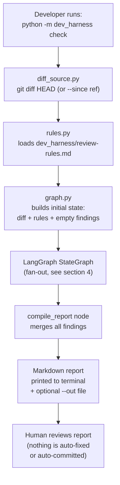
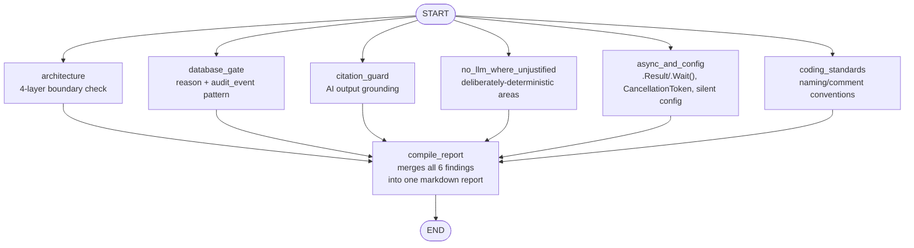
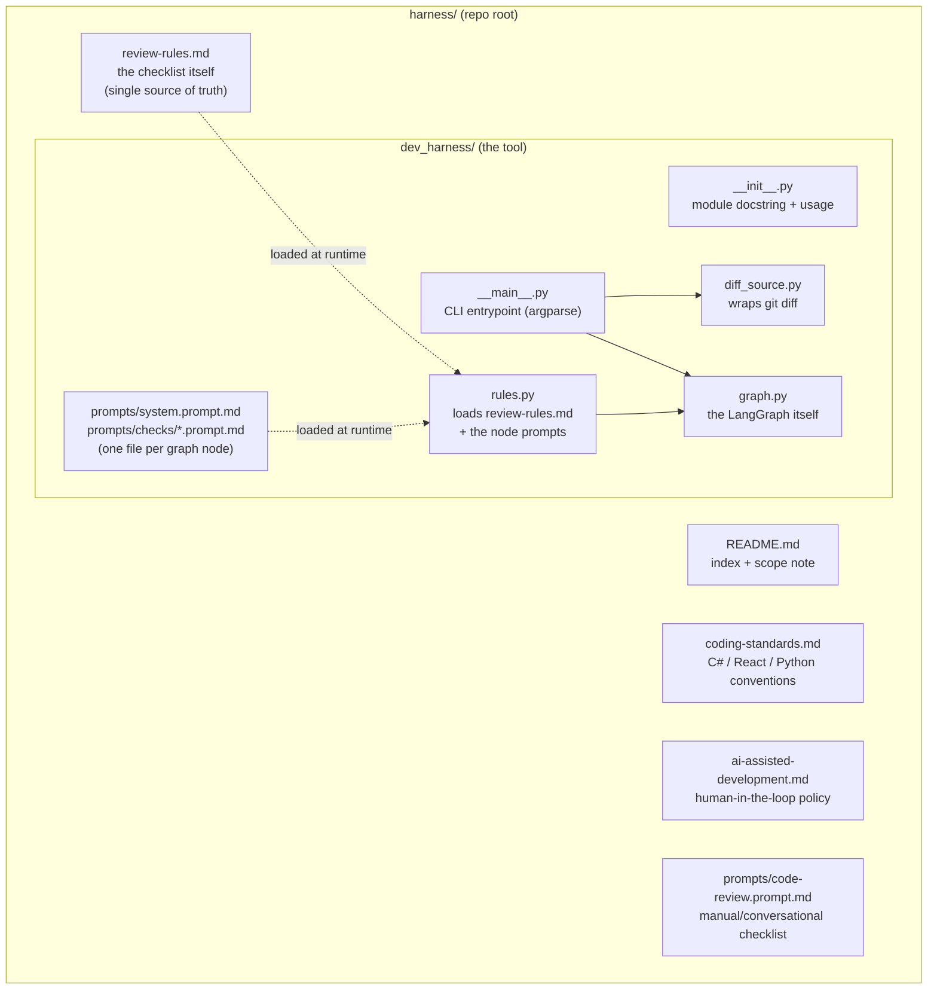
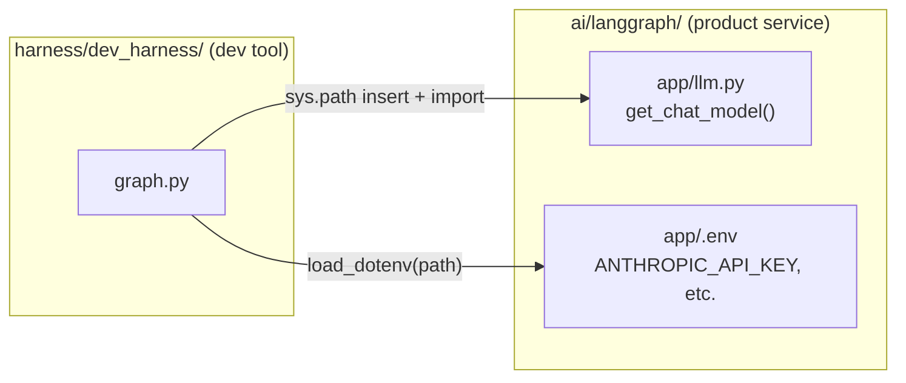

# Dev Harness — LangGraph Architecture & Flow

**Location of the tool itself:** `harness/dev_harness/`
**Status:** Working locally; draft informational CI pipeline in `.azure-pipelines/harness/dev-harness.yml`
**Related:** [`harness/README.md`](../../harness/README.md) · [`dev_harness/review-rules.md`](../../harness/dev_harness/review-rules.md) · [`langgraph-integration.md`](langgraph-integration.md) (the *product* LangGraph service — unrelated at runtime) · [`langgraph-evaluation.md`](langgraph-evaluation.md)

---

## 1. What this document covers

This document explains the **dev harness** — a separate, small LangGraph graph that reviews a local `git diff` against this repo's own coding/review standards before you commit. It is development tooling only:

- It is **not** called by the deployed Risk Assessment Workbench.
- It is **not** the same thing as `ai/langgraph/`'s product graphs (Category Mapping, Document Extraction, Narrative Drafting) — it just happens to reuse the same `get_chat_model()` function and the same local `.env` for convenience.
- It exists because this repo previously had **no automated linting or standards enforcement at all** — no `.editorconfig`, no ESLint config, no review checklist. This closes that gap for local development.

---

## 2. Why this is a LangGraph graph and not a single prompt

- Each "check" (architecture layering, database gate pattern, citation guard, etc.) is a **separate, narrowly-scoped concern**.
- A single large prompt asking a model to check everything at once tends to miss things or blend concerns together.
- LangGraph lets each concern be its **own node**, with its own short, focused instruction, run independently against the same diff.
- This mirrors the same design principle already used in the product's `category_mapping.py` graph: narrow role-scoped prompts beat one general-purpose prompt.

---

## 3. High-level flow



- **Nothing is auto-applied.** The harness only ever produces a report. This matches the project's broader "system prepares, humans decide" philosophy — applied here to the *development process* itself, not just product data.
- **Grounded input only.** Each node only ever sees the diff and the rules text — never the whole repository — the same grounding discipline used by the product's AI clients (citation-fabrication guard).

---

## 4. The graph itself — fan-out / fan-in



- **Fan-out:** all six check nodes run from `START` independently — each gets the same `diff` and `rules` state, but a different single-concern instruction.
- **Fan-in:** `compile_report` is the only node every check feeds into; it waits for all six before producing the final report.
- **State merge rule:** each check node only writes to its *own* key in a shared `findings` dictionary (`Annotated[dict[str, str], _merge_findings]`). This is required because LangGraph runs fanned-out nodes concurrently — if two nodes tried to write the same state key, it would raise a conflicting-update error. Each node's return value is scoped to just `{"findings": {<its own name>: <its own result>}}`.

---

## 5. What each node actually checks

- **`architecture`**
  - Confirms the 4-layer boundary is respected: `1-API → 2-Infrastructure → 3-Service → 4-Persistence`.
  - Flags business logic placed in a controller, or persistence logic placed in a controller/service.
  - Flags an interface implemented outside `3-Service`/`4-Persistence`.
- **`database_gate`**
  - Confirms any new override of an AI-generated or calculated value takes a mandatory `reason` parameter.
  - Confirms the underlying stored function (`func_...`) writes an `audit_event` row in the same transaction.
  - Flags a schema change made by hand-editing a generated deploy script instead of the SQL project's source function/table definitions.
- **`citation_guard`**
  - Confirms any AI client output (C# `IChatCompletionClient` calls, or Python `get_chat_model()` calls) still drops or flags anything not traceable to its supplied input.
  - Flags a `SystemPrompt` constant that changed without its mirrored `ai/prompts/*.md` file changing (or vice versa).
- **`no_llm_where_unjustified`**
  - Flags a new LLM call added inside an area that is deliberately deterministic today (Policy Research / `func_searchPolicyChunks`, Scoring / `ScoringService`).
  - Reported as "worth a second look," not an automatic failure — this project treats "when NOT to use an LLM" as a deliberate design decision, not an oversight to always reverse.
- **`async_and_config`**
  - Flags `.Result` or `.Wait()` usage.
  - Flags a new async service/persistence call that doesn't forward a `CancellationToken`.
  - Flags new AI-adjacent or external-integration config that silently defaults instead of failing loudly when missing.
- **`coding_standards`**
  - Compares the diff against naming, comment, and layer conventions summarized in `dev_harness/coding-standards.md`.
  - Scoped to flag only clear, concrete violations — not general style nitpicks the rules don't mention.

---

## 6. Module layout



- **`review-rules.md` is the single source of truth.** `rules.py` loads this file's raw text directly — there is no separate copy of the rules baked into the Python code, so the checklist can't drift out of sync between what a human reads and what the harness checks against.
- **The prompts each node runs are files, not Python strings.** `prompts/system.prompt.md` is shared by every node; `prompts/checks/<node>.prompt.md` is the one concern a node owns, and the file name is the node name. `rules.py` loads them, so adding or tuning a check is a prompt-file edit with no change to `graph.py`.
- **`__main__.py` is the only entrypoint.** It wires `diff_source.get_diff()` and `graph.run_harness()` together and handles CLI flags (`--since`, `--out`).
- **`graph.py` owns all LangGraph-specific code.** Nothing else in the module imports `langgraph` directly.

---

## 7. How it connects to `ai/langgraph/` (without depending on it)



- `graph.py` adds `ai/langgraph/` to `sys.path` at import time and imports `app.llm.get_chat_model()` directly — no package installation step, no duplicated provider-selection logic.
- It also calls `load_dotenv()` pointed at `ai/langgraph/.env`, so it picks up the same `LLM_PROVIDER`/`ANTHROPIC_API_KEY` configuration already set up for the product service.
- **This is a one-way, convenience-only dependency.** The product service (`ai/langgraph/app/`) has no awareness of, and no dependency on, `harness/dev_harness/`. Deleting the `harness/` folder entirely would not affect the product service.

---

## 8. Running it

```powershell
cd harness
$env:SSL_CERT_FILE="$env:USERPROFILE\.azure\corp_cacert.pem"   # only behind TLS inspection
..\ai\langgraph\.venv\Scripts\python.exe -m dev_harness check
```

- **Review a specific range** instead of the working tree: `... check --since HEAD~1`
- **Save the report to a file**: `... check --out last-report.md`
- **Reading the output:** each section heading matches a node name above; `OK - no issues found` means that concern had nothing to flag. Findings include severity, file, line (if known), rule violated, and a recommendation.

---

## 9. Current limitations (fast-follow candidates)

- Only the diff text is reviewed — the harness doesn't check whether a file *mentioned* as needing an update (e.g. a mirrored prompt doc) was actually changed elsewhere in the repo.
- CI integration is a draft, informational pipeline (`.azure-pipelines/harness/dev-harness.yml`)
  that publishes the report as a build artifact; it is not a required check and does not comment
  on the PR yet.
- "Gate table sync" (a new epic/AI touchpoint added without a matching row in `docs/governance/human-in-the-loop-gates.md`) and eval-dataset coverage are currently folded loosely into the `database_gate`/`citation_guard` nodes rather than being their own dedicated checks.
