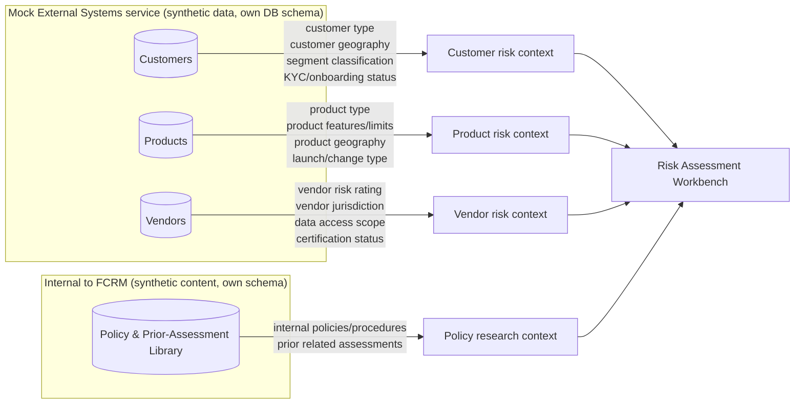
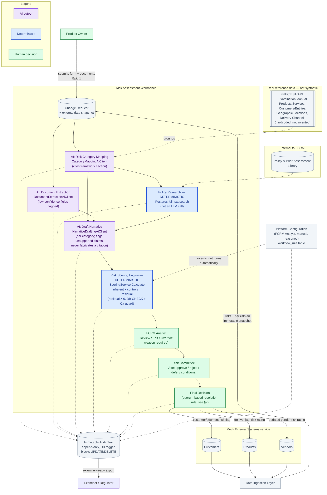
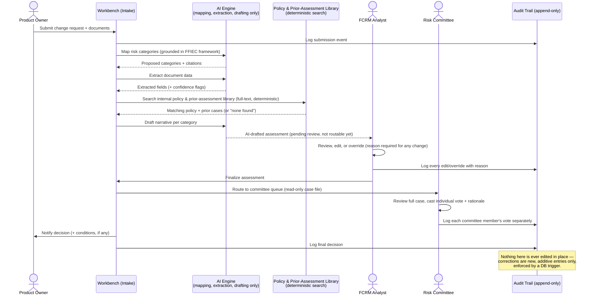
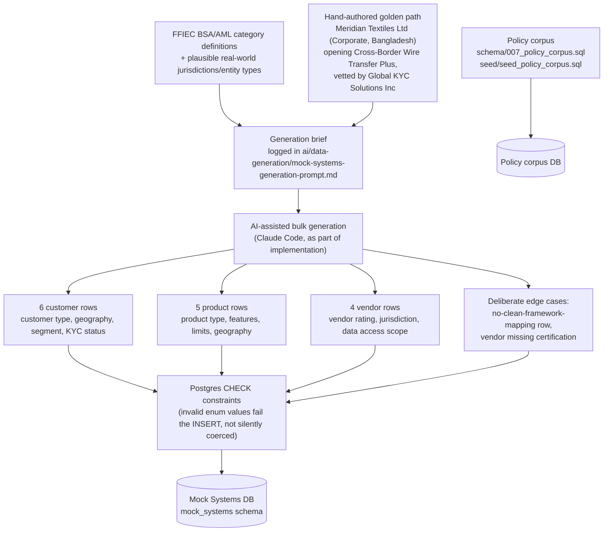
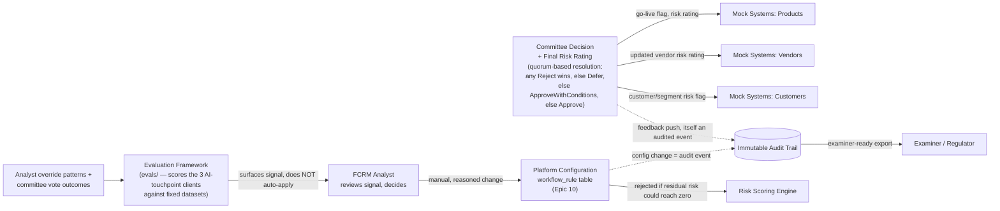

# Platform Ecosystem Diagram — Risk Assessment Workbench

**Provenance:** this is "the architect's Platform Ecosystem Diagram," referenced by name in [`README.md`](../../README.md)'s "Ecosystem expansion" section and [`ai/data-generation/README.md`](../../ai/data-generation/README.md) — both credit it for the hand-authored-golden-path + AI-assisted-bulk-variation data approach, the Data Ingestion Layer boundary, and the feedback loop, all of which shipped in `release/1.00`. The file itself was never committed anywhere until now (it lived in a separate working copy while the build happened). This revision brings it in line with what was actually built, replacing the earlier draft's assumptions with the real, shipped decisions — see [`architecture-mapping.md`](architecture-mapping.md) and [`human-in-the-loop-gates.md`](../governance/human-in-the-loop-gates.md) for the code-level detail this diagram summarizes at a conceptual level.

**Status:** current as of 2026-09-23, reconciled against the shipped `release/1.00` implementation. See the revision log at the bottom for what changed and why.

---

## 1. Component inventory

Everything in this ecosystem falls into one of four categories. Keeping this distinction explicit matters for the hackathon's "synthetic data only" rule and its "AI vs. deterministic" judging criterion.

| Component | Real or synthetic | AI-assisted or deterministic | Notes |
|---|---|---|---|
| Product Owner | Synthetic (fictional demo user, `seed_dev_users.sql`) | Human | **The actual origin of a change request** (Epic 1) — submits the form and attaches documents; not a data feed |
| Mock CRM / Core Banking / Vendor Management | Synthetic (fabricated) | — | Three logical domains (customers, products, vendors), served by one real, separately-deployed service — `Humaid.RiskGovernance.MockSystems` (`src/6-MockExternalSystems/`), its own port, own Postgres schema. Deliberately outside the Workbench (Epic 14, US-14.1/14.2/14.6) |
| Internal Policy & Prior-Assessment Library | Synthetic content, aligned to the real framework | — | Epic 3's data source — real schema/seed exist (`schema/007_policy_corpus.sql`, `seed/seed_policy_corpus.sql`); `Policy Research` below searches it |
| Regulatory Framework reference | **Real**, cited | — | **FFIEC BSA/AML Examination Manual** — four categories: Products & Services, Customers & Entities, Geographic Locations, Delivery Channels. Hardcoded per `CLAUDE.md` and `seed/seed_ffiec_framework.sql` — the one thing in this ecosystem that must NOT be invented |
| Data Ingestion Layer | N/A (infrastructure) | Deterministic | The only component allowed to call the Mock Systems service — see §6 (Epic 14, US-14.3/14.4) |
| Risk Category Mapping | Synthetic output | **AI** (`CategoryMappingAiClient`, real Claude/Azure Foundry call) | Proposes categories, always paired with human override capability (Epic 2) |
| Document Extraction | Synthetic output | **AI** (`DocumentExtractionAiClient`, real call) | Structured facts pulled from uploaded documents; text extraction itself (PdfPig/OpenXml) is deterministic, only the field interpretation is AI (Epic 4) |
| Policy Research | Synthetic output | **Deterministic** — Postgres full-text search (`func_searchPolicyChunks`), **not an LLM call** | Surfaces relevant internal policy + prior assessments (Epic 3) |
| AI-Drafted Assessment | Synthetic output | **AI** (`NarrativeDraftingAiClient`, real call) | Per-category narrative + preliminary ratings; flags (never fabricates) any claim not traceable to a supplied source; never routable to committee un-reviewed (Epic 5) |
| Risk Scoring Engine | Synthetic output | **Deterministic** — `ScoringService.Calculate`, no LLM | Controls mitigate, never zero out, residual risk — enforced by a DB `CHECK (residual_rating > 0)` constraint *and* a C# guard, both layers (Epic 7) |
| FCRM Analyst Review | Fictional demo user | Human | Finalizes; every edit/override requires a stated reason (Epic 6) |
| Risk Committee Vote | Fictional demo users | Human | Individual votes recorded, never anonymously aggregated; quorum-based resolution rule (see §7) (Epic 8) |
| Immutable Audit Trail | Synthetic content, real design requirement | Deterministic | Append-only — enforced by a database trigger that rejects `UPDATE`/`DELETE` outright, not just application-level choice (Epic 9) |
| Platform Configuration (Analyst-Owned) | N/A (infrastructure/config) | Human, with deterministic validation | **Manual**, reasoned changes to the `workflow_rule` table (scoring + committee/escalation rules, Epic 10) — not an automated tuning loop; validation rejects any config that would let residual risk reach zero |

---

## 2 & 3. Data sources and the data elements they contribute

Three logical mock-system domains feed the Workbench, standing in for systems a real bank would already have — served by one real service (`Humaid.RiskGovernance.MockSystems`), not three separate deployments. A fourth source — **internal**, not part of that service — is Epic 3's policy/prior-assessment library:

**Why these three domains, and why these fields:** they map directly onto three of the six change-request types in the brief (customer segment, product/feature, vendor) and onto the FFIEC categories the rest of the system scores against — who the customer is, what the product does, where it operates, and who the bank does business with. Geography shows up in more than one source deliberately: a customer's geography, a product's operating geography, and a vendor's jurisdiction are three distinct risk signals that can point in different directions, and the Workbench keeps them apart rather than flattening them into one "geography" field.

**Why the policy library is drawn separately:** Epic 3 (US-3.1/US-3.2) requires surfacing "internal policies, procedures, and prior related assessments" — that's FCRM's own knowledge base, not a system the rest of the bank owns. It doesn't cross the Mock-Systems boundary the ingestion layer enforces in §6, so it's modeled as a distinct internal source.

---

## 4. The risk scoring engine and the intake → audit workflow

This is the core of the Workbench. The flowchart below shows every processing step a change request passes through, which steps are genuinely AI-assisted vs. deterministic vs. human, and how the (real) regulatory framework grounds category mapping rather than letting the AI invent categories.

The same workflow, shown as a sequence over time between actors — useful for seeing *when* a human is required to act versus when the system can proceed on its own, and where the AI Engine is actually involved versus not:

**Key invariants visible in both diagrams:** the flow originates with the Product Owner, not a data feed (Epic 1); the AI Engine never talks directly to the Risk Committee; no arrow skips the FCRM Analyst review step; Policy Research and Scoring are deterministic, not AI, so only three epics (2, 4, 5) actually call a language model (Epic 14's mock systems and ingestion are deterministic integration); and Platform Configuration governs the scoring engine through a human-initiated, audited action, not an automatic connection. That's the "system prepares, humans decide" rule made structural rather than just stated. The first flowchart is color-coded to make this scannable at a glance — purple for AI output, blue for deterministic, green for a human decision, gray for infrastructure/data (see its Legend) — rather than requiring a read of every label; the sequence diagram carries the same distinction natively, since mermaid already renders actors (Product Owner, FCRM Analyst, Risk Committee) as stick figures, distinct from the system participants. For the full epic-by-epic AI/human gate breakdown, see [`human-in-the-loop-gates.md`](../governance/human-in-the-loop-gates.md), which has its own diagram of the same split.

---

## 5. Mock data generation — how synthetic data was actually created

Per [`ai/data-generation/README.md`](../../ai/data-generation/README.md), generation was hybrid, exactly as this diagram originally proposed: one hand-authored "golden path" scenario for demo reliability, plus AI-assisted bulk variation for the rest — both grounded in the FFIEC categories the project already cites, not random noise.

The edge cases exist to break a case that shouldn't silently pass, not to pad out the dataset: a domestic retail customer paired with a cosmetic process change (nothing maps cleanly onto any FFIEC category — exercises the "don't guess when nothing applies" path, also used directly by `evals/datasets/category_mapping.json`'s `cm-05-no-framework-mapping` case), and a vendor with `certification_status: None`, high risk rating, a Cayman Islands jurisdiction, and broad data access scope (the least-defensible vendor row on purpose).

---

## 6. Data flow into the Workbench

Already shown structurally in §4 (`Mock Systems service → Data Ingestion Layer → Change Request`), but worth stating explicitly: the **Data Ingestion Layer is the only component allowed to call the Mock External Systems service**, and only over HTTP. Nothing downstream (the AI engine, the analyst UI, the scoring engine) talks to Customers/Products/Vendors directly — everything downstream only ever sees the immutable `ChangeRequest` snapshot that ingestion linked and persisted at intake. This keeps the "synthetic data only, no connection to any real system" constraint enforceable in one place instead of scattered across every component that might otherwise be tempted to reach out to a live system later.

---

## 7. Feedback loops — how Workbench outputs update other systems

Two distinct feedback loops exist: an **external** one (decisions flowing back to Mock Systems, shipped) and an **internal** one (override/vote history informing a human config decision — where the evaluation framework lives).

**External loop, shipped (specified in Epic 14, US-14.5):** a committee decision pushes a go-live flag / updated risk rating / risk flag back to whichever Mock Systems entity the change request was linked to — itself an audited event, with best-effort error handling (covered by unit tests). **Internal loop:** every override and every committee vote is a signal about where the AI's first pass was wrong, which feeds the evaluation framework — but per US-10.1's second acceptance criterion, that signal only ever reaches production through an **FCRM Analyst manually changing a config value with a stated reason**; there is no path where the system updates its own scoring weights or prompts. The same config surface also covers workflow rules (US-10.2 — committee quorum, escalation) via the `workflow_rule` table, not just scoring, and every config change is itself an audit event.

---

## What's still open (per the project README's own "Not yet wired" list)

- Auth0 tenant configuration — endpoints are `[Authorize]`-protected, but a Development-only bypass stands in until a real tenant exists.
- The Azure AI Foundry project itself — the `IChatCompletionClient` abstraction supports it (`AI_PROVIDER=AzureFoundry`), but no Foundry project has been provisioned yet; defaults to calling Anthropic directly.
- Terraform/Bicep for the target Azure deployment shape — documented in `ops/README.md`, DevOps' explicit ownership, not started.

---

## Revision log

- **2026-09-23** — color-coded the §4 workflow flowchart (purple = AI, blue = deterministic, green = human, gray = infrastructure) with a Legend subgraph, per Shanthi's standup feedback that the diagram should make the AI-vs-human split explicit at a glance rather than requiring every label to be read. No structural change to the diagram itself. `docs/governance/human-in-the-loop-gates.md` gained a matching diagram of the same split, one subgraph per epic, using the same color key.
- **2026-09-20** — aligned with the new Epic 14 (Mock External Systems & Data Ingestion) in `docs/requirements/user-stories.md`: the mock-systems, ingestion, and feedback-loop components now cite the stories that specify them (US-14.1–14.6). Numbered 14 rather than 11 because Epics 11–13 (Access Control, Deployment and Operations, NFRs) were already claimed in Azure Boards. No diagram changes — the components themselves were already accurate; they just had no stories behind them.
- **2026-09-18 (reverted)** — a follow-up pass (now reverted) had corrected the Data Ingestion Layer to describe Mock Systems linking as *optional*, matching the `Intake.jsx` code as it stood at the time. Team direction has since moved back toward Mock Systems data being the primary, expected intake path (Suleman is implementing this), so that correction no longer reflects where the system is headed. Reverted rather than left half-consistent with two different intents. **The epics/stories are being updated to match this direction — see `docs/requirements/user-stories.md` and Azure Boards; if `Intake.jsx` still shows optional linking, that's the code catching up, not this diagram being wrong.**
- **2026-09-18** — reconciled against the shipped `release/1.00` implementation (this diagram had been evolving in a separate working copy while the real build happened in parallel). Corrected: Policy Research is deterministic full-text search, not an AI call — three of the ten epics call a model, not four; the framework is FFIEC-only (four hardcoded categories), not FFIEC-plus-Wolfsberg-plus-FATF; the committee resolution rule is a specific, already-implemented quorum algorithm, not an open question; the three mock systems are one real service (`Humaid.RiskGovernance.MockSystems`) with three logical domains, not three separate systems; the mock-data-generation pipeline and the policy corpus were both actually built (`schema/007_policy_corpus.sql`, `seed/seed_policy_corpus.sql`) — no longer a backlog gap. Removed references to a parallel doc set (`data-strategy.md`, a separate `docs/governance/001-risk-framework-selection.md`, an Azure Boards project under a different org) that never existed in this repo.
- **2026-09-15** (prior working copy) — added Product Owner as the flow's actual origin, added the internal Policy & Prior-Assessment Library, fixed the internal feedback loop to be analyst-driven rather than automated, added Platform Configuration as a component.
- **2026-09-08** (prior working copy) — original draft: component inventory, data sources, main workflow + sequence diagrams, mock data generation pipeline, ingestion boundary, feedback loops.
