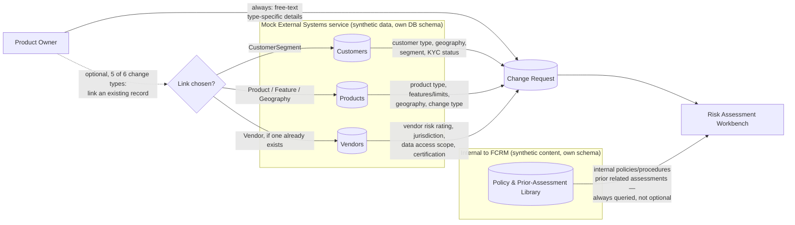
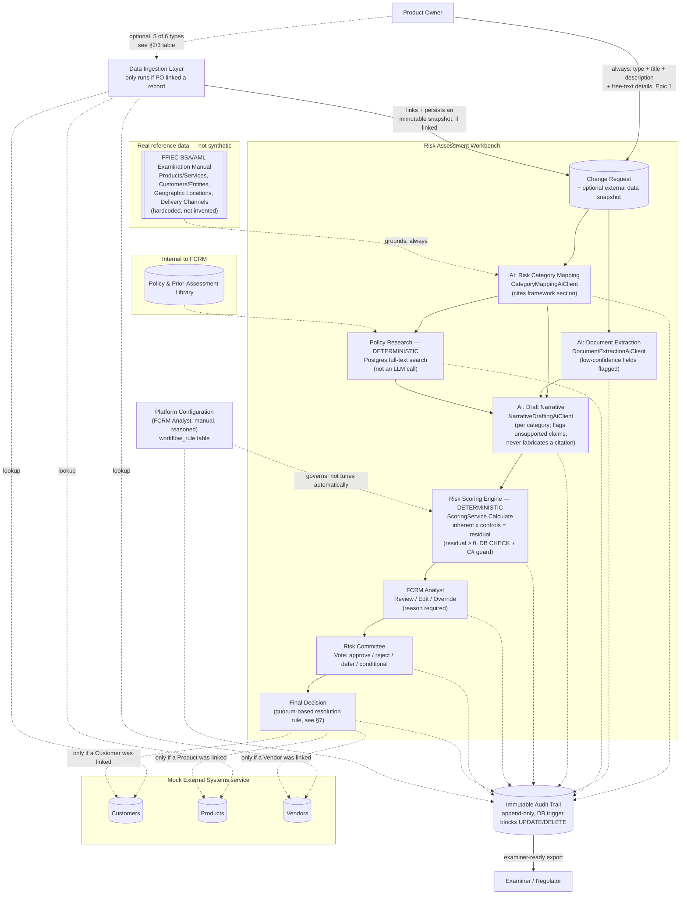
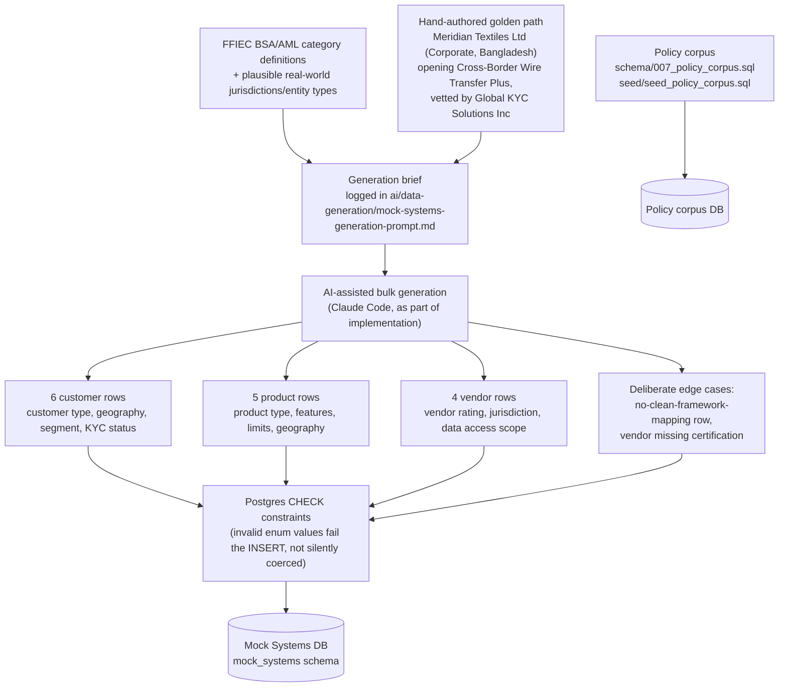
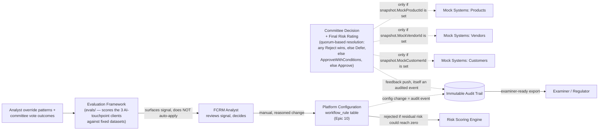

# Platform Ecosystem Diagram — Risk Assessment Workbench

**Provenance:** this is "the architect's Platform Ecosystem Diagram," referenced by name in [`README.md`](../../README.md)'s "Ecosystem expansion" section and [`ai/data-generation/README.md`](../../ai/data-generation/README.md) — both credit it for the hand-authored-golden-path + AI-assisted-bulk-variation data approach, the Data Ingestion Layer boundary, and the feedback loop, all of which shipped in `release/1.00`. The file itself was never committed anywhere until now (it lived in a separate working copy while the build happened). This revision brings it in line with what was actually built, replacing the earlier draft's assumptions with the real, shipped decisions — see [`architecture-mapping.md`](architecture-mapping.md) and [`human-in-the-loop-gates.md`](../governance/human-in-the-loop-gates.md) for the code-level detail this diagram summarizes at a conceptual level.

**Status:** current as of 2026-09-18, reconciled against the shipped `release/1.00` implementation. See the revision log at the bottom for what changed and why.

---

## 1. Component inventory

Everything in this ecosystem falls into one of four categories. Keeping this distinction explicit matters for the hackathon's "synthetic data only" rule and its "AI vs. deterministic" judging criterion.

| Component | Real or synthetic | AI-assisted or deterministic | Notes |
|---|---|---|---|
| Product Owner | Synthetic (fictional demo user, `seed_dev_users.sql`) | Human | **The actual origin of a change request** (Epic 1) — always fills in a free-text "type-specific details" field, and *optionally* links to an existing Mock Systems record where one applies (see §2/3) |
| Mock CRM / Core Banking / Vendor Management | Synthetic (fabricated) | — | Three logical domains (customers, products, vendors), served by one real, separately-deployed service — `Humaid.RiskGovernance.MockSystems` (`src/6-MockExternalSystems/`), its own port, own Postgres schema. Deliberately outside the monolith |
| Internal Policy & Prior-Assessment Library | Synthetic content, aligned to the real framework | — | Epic 3's data source — real schema/seed exist (`schema/007_policy_corpus.sql`, `seed/seed_policy_corpus.sql`); `Policy Research` below searches it |
| Regulatory Framework reference | **Real**, cited | — | **FFIEC BSA/AML Examination Manual** — four categories: Products & Services, Customers & Entities, Geographic Locations, Delivery Channels. Hardcoded per `CLAUDE.md` and `seed/seed_ffiec_framework.sql` — the one thing in this ecosystem that must NOT be invented |
| Data Ingestion Layer | N/A (infrastructure) | Deterministic | The only component allowed to call the Mock Systems service — and only fires when the Product Owner chose to link a record; unlinked requests never touch it. See §6 |
| Risk Category Mapping | Synthetic output | **AI** (`CategoryMappingAiClient`, real Claude/Azure Foundry call) | Proposes categories, always paired with human override capability (Epic 2) |
| Document Extraction | Synthetic output | **AI** (`DocumentExtractionAiClient`, real call) | Structured facts pulled from uploaded documents; text extraction itself (PdfPig/OpenXml) is deterministic, only the field interpretation is AI (Epic 4) |
| Policy Research | Synthetic output | **Deterministic** — Postgres full-text search (`func_searchPolicyChunks`), **not an LLM call** | Surfaces relevant internal policy + prior assessments (Epic 3) |
| AI-Drafted Assessment | Synthetic output | **AI** (`NarrativeDraftingAiClient`, real call) | Per-category narrative + preliminary ratings; flags (never fabricates) any claim not traceable to a supplied source; never routable to committee un-reviewed (Epic 5) |
| Risk Scoring Engine | Synthetic output | **Deterministic** — `ScoringService.Calculate`, no LLM | Controls mitigate, never zero out, residual risk — enforced by a DB `CHECK (residual_rating > 0)` constraint *and* a C# guard, both layers (Epic 7) |
| FCRM Analyst Review | Fictional demo user | Human | Finalizes; every edit/override requires a stated reason (Epic 6) |
| Risk Committee Vote | Fictional demo users | Human | Individual votes recorded, never anonymously aggregated; quorum-based resolution rule (see §7) (Epic 8) |
| Immutable Audit Trail | Synthetic content, real design requirement | Deterministic | Append-only — enforced by a database trigger that rejects `UPDATE`/`DELETE` outright, not just application-level choice (Epic 9) |
| Platform Configuration (Analyst-Owned) | N/A (infrastructure/config) | Human, with deterministic validation | **Manual**, reasoned changes to the `workflow_rule` table (scoring + committee/escalation rules, Epic 10) — not an automated tuning loop; validation rejects any config that would let residual risk reach zero |

---

## 2 & 3. Data sources and the data elements they contribute

**This is optional, per-request, and per-change-type — not automatic.** Every change request always gets a free-text "type-specific details" field from the Product Owner (Epic 1, US-1.1). *Additionally*, for 5 of the 6 change types, the Product Owner can choose to link the request to an existing record in the Mock Systems service — explicitly framed in the UI as optional, done "to ground the AI category proposal," never as a replacement for the free-text field:

| Change type | Linked entity | Notes |
|---|---|---|
| Customer Segment | Customer | |
| Product | Product | |
| Feature | Product | Shares the Product lookup — a feature is modeled as a change to an existing product |
| Vendor | Vendor | The one case where **no existing record may exist yet** — a *new* vendor being onboarded is, by definition, not already in the registry. Manual free-text is the realistic path here, not a fallback |
| Geography | Product | Approximated — there's no standalone "Geography" entity in Mock Systems, so a geography change links via whichever product it affects |
| Process | *(none)* | Data Ingestion is a deliberate no-op for Process changes — nothing in Mock Systems represents an internal process |



**Why linking is optional rather than required:** an existing customer/product/vendor record isn't guaranteed to exist for every request — most obviously for Vendor onboarding, where the entire point of the change type is that the vendor is *new*. Requiring a link would break that case. Where a record does exist, linking it gives the category-mapping AI clean, structured, known-good input instead of free text it has to interpret — better for context engineering, and it makes eval datasets reproducible against fixed mock records rather than whatever a form-filler happened to type. See the design-rationale note at the end of §4.

**Why the policy library is drawn separately:** Epic 3 (US-3.1/US-3.2) requires surfacing "internal policies, procedures, and prior related assessments" — that's FCRM's own knowledge base, not a system the rest of the bank owns, and unlike the Mock Systems link, it's **always queried**, not conditional on anything the Product Owner chose at intake.

---

## 4. The risk scoring engine and the intake → audit workflow

This is the core of the Workbench. The flowchart below shows every processing step a change request passes through, which steps are genuinely AI-assisted vs. deterministic vs. human, and how the (real) regulatory framework grounds category mapping rather than letting the AI invent categories.



The same workflow, shown as a sequence over time between actors — useful for seeing *when* a human is required to act versus when the system can proceed on its own, where the AI Engine is actually involved versus not, and where the Mock Systems link is conditional rather than guaranteed:

```mermaid
sequenceDiagram
    actor PO as Product Owner
    participant WB as Workbench (Intake)
    participant AI as AI Engine<br/>(mapping, extraction, drafting only)
    participant POLICYLIB as Policy & Prior-Assessment Library<br/>(deterministic search)
    actor AN as FCRM Analyst
    actor RC as Risk Committee
    participant AUD as Audit Trail (append-only)

    PO->>WB: Submit change request (free-text details, always)
    opt Product/Customer/Vendor/Feature/Geography, and a matching record exists
        PO->>WB: Optionally link an existing Mock Systems record
        WB->>WB: Data Ingestion Layer looks up and snapshots the linked record
    end
    Note over PO,WB: Process changes have no linkable entity;<br/>a new-vendor onboarding has nothing to link to yet — both stay free-text only.
    WB->>AUD: Log submission event
    WB->>AI: Map risk categories (grounded in FFIEC framework +<br/>linked snapshot, if any)
    AI-->>WB: Proposed categories + citations
    WB->>AI: Extract document data
    AI-->>WB: Extracted fields (+ confidence flags)
    WB->>POLICYLIB: Search internal policy & prior-assessment library (full-text, deterministic)
    POLICYLIB-->>WB: Matching policy + prior cases (or "none found")
    WB->>AI: Draft narrative per category
    AI-->>AN: AI-drafted assessment (pending review, not routable yet)
    AN->>AN: Review, edit, or override (reason required for any change)
    AN->>AUD: Log every edit/override with reason
    AN->>WB: Finalize assessment
    WB->>RC: Route to committee queue (read-only case file)
    RC->>RC: Review full case, cast individual vote + rationale
    RC->>AUD: Log each committee member's vote separately
    WB->>PO: Notify decision (+ conditions, if any)
    WB->>AUD: Log final decision
    Note over AUD: Nothing here is ever edited in place —<br/>corrections are new, additive entries only,<br/>enforced by a DB trigger.
```

**Key invariants visible in both diagrams:** the flow always originates with the Product Owner typing something, never purely a data feed (Epic 1); linking to Mock Systems is optional and conditional, not automatic, and doesn't exist at all for Process changes; the AI Engine never talks directly to the Risk Committee; no arrow skips the FCRM Analyst review step; Policy Research and Scoring are deterministic, not AI, so only three of the ten epics actually call a language model; and Platform Configuration governs the scoring engine through a human-initiated, audited action, not an automatic connection. That's the "system prepares, humans decide" rule made structural rather than just stated.

**Design rationale — why optional linking, not mandatory, and not pure manual entry either:** this was worked out by checking the shipped code against the hackathon rubric directly, not assumed. Pure manual-only would score worse on *engineering judgment* (5% — the rubric rewards not making a human re-enter data a system already holds) and *context engineering* (10% — a linked record gives the category-mapping AI clean, structured input instead of free text it has to interpret) and *evaluation framework* (10% — eval cases need to be reproducible against a fixed mock record, not whatever a form-filler typed). Pure linked-only would be actively broken for new-vendor onboarding, where the entity by definition doesn't exist yet, and for Process changes, which have no entity at all. The hybrid is the design the rubric actually favors, not a compromise — it just wasn't written down anywhere until now. This should get its own `docs/governance` entry rather than living only as a code comment in `Intake.jsx`.

---

## 5. Mock data generation — how synthetic data was actually created

Per [`ai/data-generation/README.md`](../../ai/data-generation/README.md), generation was hybrid, exactly as this diagram originally proposed: one hand-authored "golden path" scenario for demo reliability, plus AI-assisted bulk variation for the rest — both grounded in the FFIEC categories the project already cites, not random noise.



The edge cases exist to break a case that shouldn't silently pass, not to pad out the dataset: a domestic retail customer paired with a cosmetic process change (nothing maps cleanly onto any FFIEC category — exercises the "don't guess when nothing applies" path, also used directly by `evals/datasets/category_mapping.json`'s `cm-05-no-framework-mapping` case), and a vendor with `certification_status: None`, high risk rating, a Cayman Islands jurisdiction, and broad data access scope (the least-defensible vendor row on purpose).

---

## 6. Data flow into the Workbench

Already shown structurally in §4 (`Mock Systems service → Data Ingestion Layer → Change Request`), but worth stating explicitly: the **Data Ingestion Layer is the only component allowed to call the Mock External Systems service**, only over HTTP, and **only when the Product Owner chose to link a record at intake** — it is not invoked for every request. Nothing downstream (the AI engine, the analyst UI, the scoring engine) talks to Customers/Products/Vendors directly — everything downstream only ever sees whatever the `ChangeRequest` already has: the free-text details always, plus the linked snapshot if one exists. This keeps the "synthetic data only, no connection to any real system" constraint enforceable in one place instead of scattered across every component that might otherwise be tempted to reach out to a live system later.

---

## 7. Feedback loops — how Workbench outputs update other systems

Two distinct feedback loops exist: an **external** one (decisions flowing back to Mock Systems, shipped) and an **internal** one (override/vote history informing a human config decision — where the evaluation framework lives).



**External loop, shipped:** a committee decision pushes a go-live flag / updated risk rating / risk flag back to whichever Mock Systems entity the change request was linked to **at intake** — a per-entity conditional check (`snapshot.MockProductId`/`MockVendorId`/`MockCustomerId` is set) in `CommitteeService`, not a guaranteed push. An unlinked request (no matching record existed, or the change type was Process) has nothing to push back to, and that's expected, not an error — itself an audited event either way, with best-effort error handling (covered by unit tests). **Internal loop:** every override and every committee vote is a signal about where the AI's first pass was wrong, which feeds the evaluation framework — but per US-10.1's second acceptance criterion, that signal only ever reaches production through an **FCRM Analyst manually changing a config value with a stated reason**; there is no path where the system updates its own scoring weights or prompts. The same config surface also covers workflow rules (US-10.2 — committee quorum, escalation) via the `workflow_rule` table, not just scoring, and every config change is itself an audit event.

---

## What's still open (per the project README's own "Not yet wired" list)

- Auth0 tenant configuration — endpoints are `[Authorize]`-protected, but a Development-only bypass stands in until a real tenant exists.
- The Azure AI Foundry project itself — the `IChatCompletionClient` abstraction supports it (`AI_PROVIDER=AzureFoundry`), but no Foundry project has been provisioned yet; defaults to calling Anthropic directly.
- Terraform/Bicep for the target Azure deployment shape — documented in `ops/README.md`, DevOps' explicit ownership, not started.

---

## Revision log

- **2026-09-18 (second pass)** — corrected the intake data model against `webapp/src/pages/Intake.jsx`: linking to a Mock Systems record is **optional**, coexists with an always-present free-text field, applies to only 5 of 6 change types (no entity for Process; Geography approximated via Product), and exists specifically to ground the AI category proposal rather than to replace manual entry. Previously this diagram (like Epic 1's stories) implied linking was either automatic or the primary path. Also made the feedback loop's Mock Systems pushes explicitly conditional per entity ID, matching `CommitteeService`'s actual per-field null checks. Added a design-rationale note explaining why this hybrid — not pure manual, not pure linked — is what the hackathon rubric actually favors (engineering judgment, context engineering, eval reproducibility all support grounding via a linked record where one exists; new-vendor-onboarding and Process changes require the free-text fallback to exist at all).
- **2026-09-18** — reconciled against the shipped `release/1.00` implementation (this diagram had been evolving in a separate working copy while the real build happened in parallel). Corrected: Policy Research is deterministic full-text search, not an AI call — three of the ten epics call a model, not four; the framework is FFIEC-only (four hardcoded categories), not FFIEC-plus-Wolfsberg-plus-FATF; the committee resolution rule is a specific, already-implemented quorum algorithm, not an open question; the three mock systems are one real service (`Humaid.RiskGovernance.MockSystems`) with three logical domains, not three separate systems; the mock-data-generation pipeline and the policy corpus were both actually built (`schema/007_policy_corpus.sql`, `seed/seed_policy_corpus.sql`) — no longer a backlog gap. Removed references to a parallel doc set (`data-strategy.md`, a separate `docs/governance/001-risk-framework-selection.md`, an Azure Boards project under a different org) that never existed in this repo.
- **2026-09-15** (prior working copy) — added Product Owner as the flow's actual origin, added the internal Policy & Prior-Assessment Library, fixed the internal feedback loop to be analyst-driven rather than automated, added Platform Configuration as a component.
- **2026-09-08** (prior working copy) — original draft: component inventory, data sources, main workflow + sequence diagrams, mock data generation pipeline, ingestion boundary, feedback loops.
