# Infrastructure Architecture — Risk Assessment Workbench

**Status:** current as of 2026-09-23, reflects the Terraform in [`iac/environments/dev`](../../iac/environments/dev). See [`architecture-mapping.md`](architecture-mapping.md) for the application-layer decisions and [`ecosystem-diagram.md`](ecosystem-diagram.md) for the functional/data ecosystem this infrastructure hosts.

---

## 1. Component inventory

| Component | Purpose | Notes |
|---|---|---|
| Resource Group | Deployment boundary | One per environment (dev, etc.) |
| Virtual Network | Network isolation | Two subnets: one delegated to Container Apps, one dedicated to private endpoints |
| Container Apps Environment | Compute host (Consumption plan) | VNet-integrated |
| Container App — Workbench | Analyst-facing UI | External ingress |
| Container App — Backend / Mock API | Internal API + mock external systems | Internal ingress only, not reachable from outside the environment |
| Container Registry | Image storage | Pulled by both container apps via a user-assigned managed identity |
| Key Vault | Secrets & certificates | Private endpoint + firewall allow-list |
| Storage Account | Blob, Queue, File, Table | Private endpoints + firewall allow-list |
| PostgreSQL Flexible Server | Application database | Private endpoint, Azure AD authentication, firewall allow-list |
| Log Analytics Workspace + Application Insights | Monitoring, logs, traces | Shared across the environment |

---

## 2. What's actually deployed

Two application images ship into this infrastructure, both built from Dockerfiles in this repo and pushed to the Container Registry:

| Container App | Source | Role |
|---|---|---|
| Workbench App | [`src/1-API/Humaid.RiskGovernance.AdminUI.Web`](../../src/1-API/Humaid.RiskGovernance.AdminUI.Web) | The 5-layer Clean Architecture app (`1-API` → `2-Infrastructure` → `3-Service` → `4-Persistence`, see [`architecture-mapping.md`](architecture-mapping.md)) — the analyst-facing Risk Assessment Workbench. External ingress. |
| Backend / Mock API | [`src/6-MockExternalSystems/Humaid.RiskGovernance.MockSystems`](../../src/6-MockExternalSystems/Humaid.RiskGovernance.MockSystems) | Stands in for the bank's real Customers/Products/Vendors systems (per [`ecosystem-diagram.md`](ecosystem-diagram.md) §2/§3) — its own Dockerfile, own DB functions/schema. Internal ingress only; the Workbench is its one allowed caller (`MOCK_SYSTEMS_BASE_URL` env var, resolved via the Container Apps Environment's internal DNS). |

How each infra resource maps to what the code actually does with it:

- **Key Vault** — both apps get its URI via `PEP_KEY_VAULT`; used at runtime to fetch secrets (AI provider keys, connection secrets) rather than baking them into app config or image.
- **Storage Account (Blob)** — `BLOB_STORAGE_SERVICE_URI` on both apps; backs document upload/storage for the change-request attachments the Workbench's intake flow (Epic 1) and document extraction (Epic 4, `Humaid.RiskGovernance.AdminUI.AI`) work against. Queue and Table are provisioned alongside it but not yet wired into app code.
- **PostgreSQL Flexible Server** — one server, shared by both apps, each connecting with its own Azure AD identity (`AZURE_POSTGRESQL_ENDPOINT` / `BACKEND_APP_AZURE_POSTGRESQL_ENDPOINT` — same host, different `User Id`, no passwords in config). The Workbench's schema (`src/4-Persistence/Humaid.RiskGovernance.AdminUI.DB` — change requests, assessments, scoring, committee, audit trail, policy corpus) and the Mock Systems schema (`.../MockSystems/db/schema.sql` — customers, products, vendors) live on the same server, kept apart by identity/schema rather than by separate infrastructure — a hackathon-scope simplification, not a production target.
- **AI integration** (`FOUNDRY_PROJECT_ENDPOINT`, `FOUNDRY_MODEL_DEPLOYMENT`, `ANTHROPIC_MODEL`, `AI_PROVIDER`) — only on the Workbench app, feeding `src/3-Service/Humaid.RiskGovernance.AdminUI.AI`, the project that owns category mapping, document extraction, and narrative drafting (Epics 2/4/5). Azure AI Foundry (`AI_PROVIDER=AzureFoundry`) was the initial plan, for securely accessing the LLMs from inside Azure — but the free-trial subscription doesn't allow provisioning the more capable models the workload needs, so the team shifted to calling Anthropic's models directly instead.
- **Log Analytics / Application Insights** — `APPLICATIONINSIGHTS_CONNECTION_STRING` is wired into the Workbench app only; the backend/mock-API app doesn't yet emit telemetry to it.
- **Container Registry** — the target for both apps' CI-built images; pulled at runtime via the shared user-assigned identity's `AcrPull` role, not admin credentials.

---

## 3. Technology architecture

```mermaid
flowchart LR
    USERS(["Users"])
    AISVC(["AI Provider<br/>Anthropic / Azure AI Foundry"])

    subgraph SUB["Subscription"]
        subgraph RG["Resource Group"]
            KV["Key Vault"]
            ACR["Container Registry"]

            subgraph COMPUTE["Container Apps Environment"]
                CAUI["Workbench App"]
                CABACK["Backend / Mock API"]
            end

            subgraph MON["Monitor, Insights, Logs"]
                LAW["Log Analytics"]
                APPI["Application Insights"]
            end

            subgraph STORAGE["Storage"]
                BLOB["Storage Blob"]
                QUEUE["Storage Queue"]
                PG["PostgreSQL"]
                TABLE["Tables"]
            end
        end
    end

    USERS --> CAUI
    KV --> COMPUTE
    ACR --> COMPUTE
    CAUI --> CABACK
    CAUI -->|category mapping, document<br/>extraction, narrative drafting| AISVC
    COMPUTE --> STORAGE
    COMPUTE --> MON
    STORAGE --> MON
```

---

## 4. Network & security posture

- **Network isolation:** Key Vault, Storage, and PostgreSQL are all reachable from inside the VNet via private endpoints on a dedicated subnet; the Container Apps Environment sits on its own delegated subnet.
- **Defense in depth:** each of Key Vault, Storage, and PostgreSQL also carries a firewall IP allow-list (team VPN egress IPs) as a secondary access path for out-of-band administration, on top of the private endpoint.
- **Identity, not secrets, for service-to-service access:** both container apps use system-assigned managed identities for Key Vault (Secrets/Certificate User) and Storage (Blob/Queue Data Contributor) roles, and a shared user-assigned identity with `AcrPull` for image pulls — no credentials stored in app config.
- **Ingress boundary:** the Workbench UI is the only externally reachable component; the backend/mock-API app is internal-only, resolved through the Container Apps Environment's private DNS binding to the VNet.
- **Cost-conscious posture (hackathon scope):** diagnostic settings, ACR geo-replication/Premium features, and some storage hardening checks are deferred — see [`.checkov.yml`](../../.azure-pipelines/iac/.checkov.yml) for the specific suppressions and justifications.

---

## Revision log

- **2026-09-23** — initial version, authored directly from the shipped Terraform in `iac/environments/dev`.
