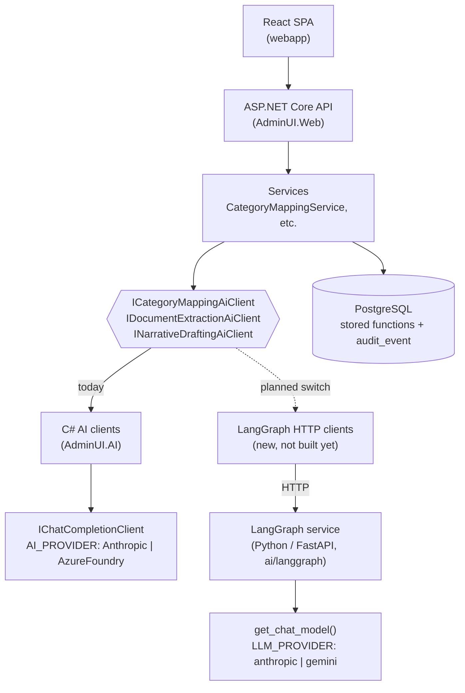

# LangGraph Integration — How It Fits the Risk Assessment Workbench

**Status:** Python service built and tested for Category Mapping; .NET wiring not yet done.
**Location:** `ai/langgraph/`
**Related:** [ecosystem-diagram.md](ecosystem-diagram.md) · [../governance/human-in-the-loop-gates.md](../governance/human-in-the-loop-gates.md) · [../../ai/how-the-ai-thinks.md](../../ai/how-the-ai-thinks.md) · [../../ai/langgraph/README.md](../../ai/langgraph/README.md)

---

## 1. The one-sentence version

The LangGraph service is an **alternate engine behind the same three AI interfaces** the Workbench already uses. It changes *how* the AI step is orchestrated, not *what* the Workbench does with the result, and it does not change who decides. Humans still own every gate.

---

## 2. Where it sits

The Workbench already has three AI touchpoints, each behind an interface in `src/2-Infrastructure/.../Interfaces/Ai/`:

| Workbench epic | Interface | Today (C#) | LangGraph equivalent | Status |
|---|---|---|---|---|
| 2 — Category Mapping | `ICategoryMappingAiClient` | `CategoryMappingAiClient` → Claude | `POST /category-mapping` | **Working, tested** |
| 4 — Document Extraction | `IDocumentExtractionAiClient` | `DocumentExtractionAiClient` → Claude | `POST /document-extraction` | Stub |
| 5 — Narrative Drafting | `INarrativeDraftingAiClient` | `NarrativeDraftingAiClient` → Claude | `POST /narrative-drafting` | Stub |

Epics 3 (Policy Research), 7 (Scoring), 8 (Committee) and 14 (Mock Systems) contain **no LLM call** and are not affected.



The dotted line is the only thing left to build on the .NET side. Everything above the interfaces (controllers, services, database, webapp) is unaware of which engine answered.

---

## 3. Why a separate service

LangGraph is Python-only, so it cannot be a project inside the .NET solution. It is called over HTTP, the same pattern the solution already uses for Anthropic, Azure Foundry and the mock systems. It is one more named `HttpClient`, not a special case.

Benefits:
- **Reversible.** The C# implementation stays in place. Switching engines is a configuration change.
- **Experimentable.** Multi-step reasoning (propose → self-critique → filter) can be developed and evaluated without touching the .NET solution.
- **Same guardrails.** The service reproduces the C# contract, including the safety rules below.

---

## 4. What the running service does today

Single working route: `POST /category-mapping`.

1. The caller sends the change request title and description and the **allowed categories** (id + name), which come from the seeded risk-category data.
2. The service builds a prompt and asks the model for strict JSON proposals.
3. The response is parsed; markdown code fences that Claude sometimes wraps around JSON are stripped.
4. **Allow-list guard:** any `category_id` not in the supplied list is dropped in code, never passed through.
5. If the model returns invalid JSON, the result is an empty proposal list, not a guess.

Example: an "Add MFA to online banking" request against `Cybersecurity` and `Third-Party Risk` returns only `Cybersecurity`, with a rationale.

### Files

| File | Role |
|---|---|
| `app/main.py` | FastAPI app, `/health`, `/category-mapping` |
| `app/schemas.py` | Request/response models mirroring the C# DTOs |
| `app/llm.py` | Single provider switch (`LLM_PROVIDER`) |
| `app/graphs/category_mapping.py` | The LangGraph graph (currently one node) |
| `app/graphs/document_extraction.py`, `narrative_drafting.py` | Stubs |

---

## 5. Model provider

`app/llm.py` mirrors the .NET `AI_PROVIDER` switch: one place decides the model, and every graph just receives a chat model.

| `LLM_PROVIDER` | Notes |
|---|---|
| `anthropic` (current) | Uses the same `ANTHROPIC_API_KEY`, `ANTHROPIC_MODEL`, `ANTHROPIC_WORKSPACE_ID` as the C# `ClaudeApiClient`, including the workspace header and OAuth-token handling |
| `gemini` | Sandbox alternative |
| `foundry` | Not implemented |

Misconfiguration fails loudly with a clear error rather than silently degrading, consistent with the rest of the solution.

---

## 6. How it respects the human-in-the-loop model

The governing principle is unchanged: **the system prepares, humans decide.** The LangGraph service produces only *proposals*. Nothing it returns is persisted as a decision.

| Concern | How it is preserved |
|---|---|
| Analyst review of AI output | Proposals still flow into `CategoryMappingService`; the analyst adds/removes categories with a mandatory reason (`func_overrideCategoryMapping` → `audit_event`) |
| No fabricated categories | Allow-list guard in the graph, same as C# |
| Failure behaviour | Empty result on unparseable output; the analyst maps manually |
| Auditability | Unchanged: audit rows are written by stored functions in the .NET/DB layer, not by the AI service |
| Finalization gates | Unchanged: enforced in `AssessmentService.Finalize(...)` |

Because the gates live in the .NET services and the database, swapping the AI engine cannot weaken them.

---

## 7. What is left to do

1. **Implement the remaining graphs:** document extraction (source excerpt plus `needs_review` on low confidence) and narrative drafting (separate `unsupported_claims` list).
2. **Add the .NET side:** `LangGraph*AiClient` classes implementing the three interfaces, a named `HttpClient`, and a switch such as `AI_ORCHESTRATION_PROVIDER = DotNet | LangGraph` in `Program.cs` that defaults to `DotNet`.
3. **Deepen the category graph:** split into explicit nodes (propose → critique → filter) so FFIEC rules become visible graph steps.
4. **Containerize:** add a Dockerfile and a compose service so it runs alongside the workbench.
5. **Compare engines:** run the same change requests through both and compare proposals before choosing a default.
6. **Corporate proxy:** the service needs `SSL_CERT_FILE` pointing at the corporate CA bundle when running behind TLS inspection.

---

## 8. Running it locally

```powershell
cd ai\langgraph
$env:SSL_CERT_FILE="$env:USERPROFILE\.azure\corp_cacert.pem"   # only behind TLS inspection
.\.venv\Scripts\python.exe -m uvicorn app.main:app --port 8100
```

Then open `http://localhost:8100/docs` to try `POST /category-mapping`.

---

## 9. Suggested talking points

- "We didn't replace the AI layer; we made it swappable."
- "The gates and audit trail live in .NET and Postgres, so a different AI engine can't bypass them."
- "The category graph works end to end with Claude today; extraction and drafting are next."
