# Presenter flowchart — how a change request moves through the Workbench

A deliberately simple, yes/no version of the flow for the mentor call. Narrow top-to-bottom layout so it
renders at a readable width in GitHub and the Wiki. Full detail lives in
[`ecosystem-diagram.md`](ecosystem-diagram.md) and
[`../governance/human-in-the-loop-gates.md`](../governance/human-in-the-loop-gates.md).

**Colour key:** purple = AI output, blue = deterministic (no AI), green = human decision, orange = gate enforced in code.

```mermaid
flowchart TB
    classDef ai fill:#ede4fc,stroke:#7c3aed,color:#3b0764,stroke-width:2px
    classDef det fill:#dbeafe,stroke:#1d4ed8,color:#1e3a8a,stroke-width:2px
    classDef human fill:#dcfce7,stroke:#15803d,color:#14532d,stroke-width:2px
    classDef gate fill:#fff7ed,stroke:#c2410c,color:#7c2d12,stroke-width:2px

    START(["Product Owner submits<br/>request + documents"]):::human
    START --> CAT

    CAT["AI proposes FFIEC<br/>risk categories"]:::ai
    CAT --> AIUP{"AI available?"}
    AIUP -- No --> MANUAL["Analyst picks categories<br/>manually - never blocked"]:::human
    AIUP -- Yes --> CATOK{"Analyst agrees?"}
    CATOK -- Yes --> POL
    CATOK -- "No: add or override<br/>(reason required)" --> POL
    MANUAL --> POL

    POL["Policy search<br/>(full-text, not AI)"]:::det
    POL --> REL{"Every category has a<br/>rely on / not relevant call?"}
    REL -- No --> POL
    REL -- Yes --> EXT

    EXT["AI extracts fields from<br/>the uploaded document"]:::ai
    EXT --> EXTOK{"Fields correct?"}
    EXTOK -- Yes --> NAR
    EXTOK -- "No: analyst corrects<br/>(reason required)" --> NAR

    NAR["AI drafts narrative<br/>per category"]:::ai
    NAR --> NARREV{"Analyst reviewed<br/>every section?"}
    NARREV -- "No: regenerate, edit<br/>or replace (reason)" --> NAR
    NARREV -- Yes --> SCORE

    SCORE["Score out of 5<br/>(deterministic formula)"]:::det
    SCORE --> AVG{"Average above 2.5?"}
    AVG -- No --> HOLD["Cannot finalize yet"]:::gate
    AVG -- Yes --> FIN["Analyst finalizes<br/>and routes to committee"]:::human

    FIN --> VOTE["Each member votes:<br/>Approve / Approve with conditions /<br/>Defer / Reject (reason required)"]:::human
    VOTE --> QUO{"Quorum reached?<br/>(default 2, admin-configurable)"}
    QUO -- No --> VOTE
    QUO -- Yes --> DONE(["Decision recorded<br/>Request locked, read-only<br/>Product Owner sees outcome"]):::human

    AUD[("Immutable audit trail<br/>every step above is logged")]
    DONE -.-> AUD
```

## Talking points

- **The system prepares, humans decide.** Nothing is auto-approved or auto-rejected.
- **Only three steps call an AI model:** category mapping, document extraction, narrative drafting. Policy search and scoring are deterministic.
- **An AI outage never blocks the user.** Every AI step has a manual path, and tabs are not locked.
- **Every edit to an AI output needs a stated reason.** Original and edited values are both kept.
