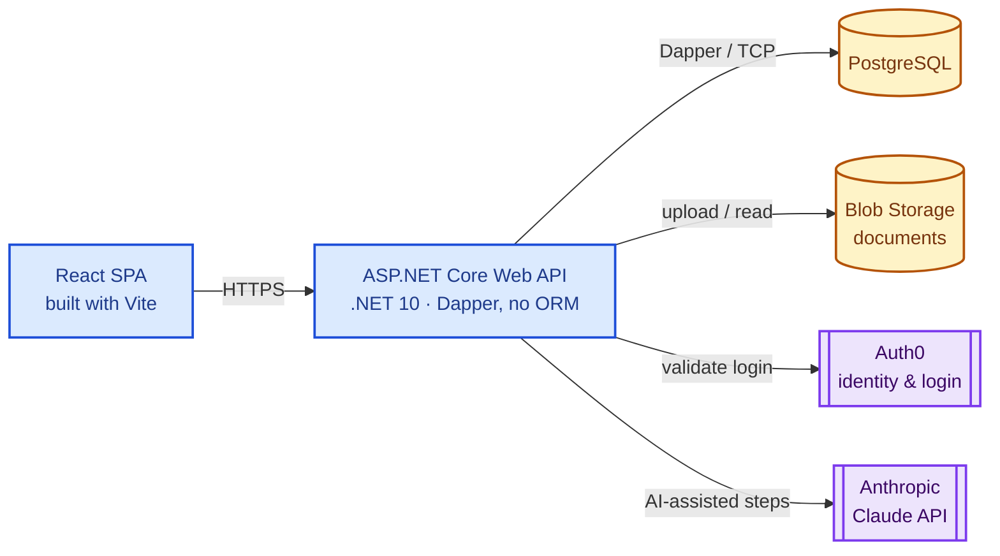
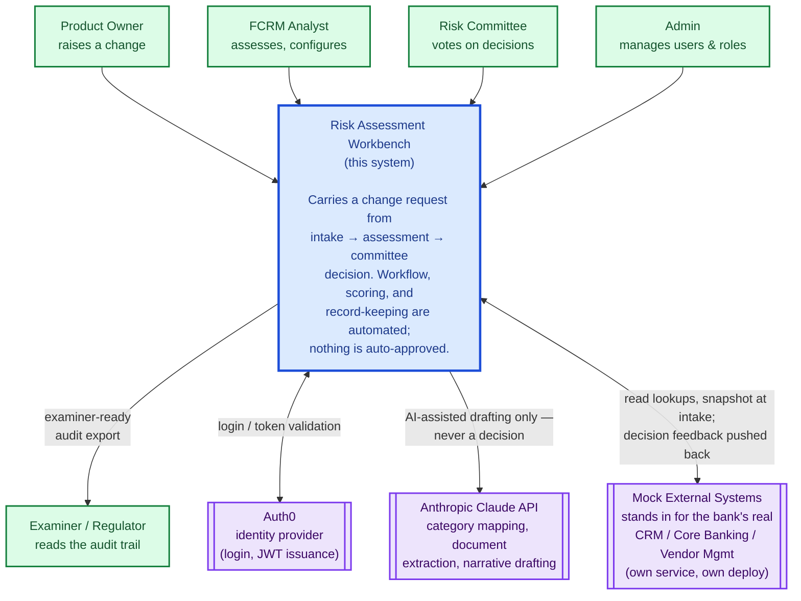
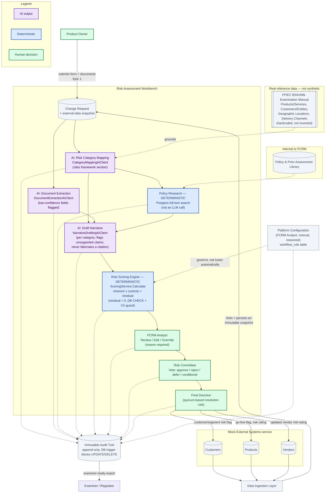

# Architecture & Flow Overview — Risk Assessment Workbench

---

## Tech Stack at a Glance

- **Frontend:** React SPA, built with Vite
- **Backend:** ASP.NET Core, .NET 10 — Dapper, no ORM
- **Database:** PostgreSQL
- **Documents:** Blob Storage
- **Identity:** Auth0
- **AI:** Anthropic Claude API
- **Deployment:** same image runs as Docker Compose locally and Azure Container Apps in the cloud

---

## 1. System Context

- **4 user roles:** Product Owner, FCRM Analyst, Risk Committee, Admin
- **Auth0** validates every login — no role is ever trusted from a request itself
- **Anthropic** is used only for AI-assisted drafting — never makes a decision
- **Mock External Systems** stands in for the bank's real CRM / Core Banking / Vendor Mgmt
- **Examiner/Regulator** consumes the audit trail, not the live system

---

## 2. Intake → Audit Workflow

- **Only 3 steps are AI:** category mapping, document extraction, narrative drafting — purple
- **Policy research & scoring are deterministic** — no LLM call, shown in blue
- **Category mapping is grounded** in the real FFIEC BSA/AML framework, not invented
- **Residual risk can never reach zero** — enforced by a DB check and a code guard
- **FCRM Analyst reviews before committee** — every edit/override needs a reason
- **Committee votes individually**; quorum-based rule decides the outcome
- **Every step is logged** to an append-only audit trail — nothing can be edited or deleted
