# Human-in-the-loop gates

Per `CLAUDE.md`: *"the system prepares, humans decide. Nothing is auto-approved or auto-rejected"*
and *"every AI-touchpoint epic pairs with a human review/override story by design... don't let an
AI output reach the committee stage without a corresponding review gate in code."* This table is
the traceability for that requirement.

| Epic | AI output | Where it's generated | Human gate | Enforced by |
|---|---|---|---|---|
| 2 — Category Mapping | Proposed risk categories + citation | `CategoryMappingAiClient` (real Claude call) | Analyst can add/remove a category; reason mandatory | `CategoryMappingService.Override(...)` → `func_overrideCategoryMapping` (writes `audit_event`); API layer returns 400 if `reason` blank |
| 3 — Policy Research | Ranked policy chunks | `func_searchPolicyChunks` — **deterministic Postgres full-text search, not an LLM call** (see architecture-mapping.md) | Analyst marks each surfaced chunk "relied upon" / "not relevant" before finalization is allowed | `PolicyResearchService.RecordReliance(...)`; `AssessmentService.Finalize(...)` blocks if any mapped category has zero reliance decisions (US-3.2) |
| 4 — Document Extraction | Structured field values + confidence | `DocumentExtractionAiClient` (real Claude call) | Analyst corrects any field; low-confidence fields pre-flagged `needs_review` | `ExtractedFieldService.Correct(...)` → `func_correctExtractedField` (writes `audit_event`) |
| 5 — AI-Drafted Narrative | Per-category narrative text | `NarrativeDraftingAiClient` (real Claude call) | Narrative is labeled "AI-drafted — pending analyst review" and cannot route to committee until every section is `AnalystReviewed`/`AnalystEdited` | `AssessmentService.Finalize(...)` checks section status; `NarrativeDraftingAiClient` flags (never fabricates) any claim not traceable to a supplied source |
| 7 — Scoring | Inherent/residual score | `ScoringService.Calculate(...)` — **deterministic formula, no LLM** | Analyst can override the calculated score; reason mandatory; residual can never be forced to 0 | `RiskScoreService.Override(...)` → `func_overrideRiskScore`; `CHECK (residual_rating > 0)` constraint + C# guard, both layers |
| 6 (cross-cutting) | Any of the above | — | Every edit to an AI-generated field requires a stated reason before save; original and edited values both retained | Generic pattern: service method signature always takes `reason`; stored function always writes `audit_event` in the same transaction as the state change |
| 8 — Committee | No AI output here at all | — | Every committee member's vote is individually recorded and never aggregated into an anonymous outcome (US-8.2 AC5); a vote can't even be cast until the assessment is routed, i.e. until Epic 6's finalize gate above has already been cleared | `CommitteeService.CastVoteAsync` checks `change_request.status == 'PendingCommittee'` before allowing a vote; `committee_vote` has one row per member, `committee_decision` is a separate, derived resolution row |
| 14 — Mock Systems / Data Ingestion | No AI output at all — deterministic integration | `DataIngestionService` (snapshot at intake), `CommitteeService.PushDecisionToMockSystemsAsync` (push-back) | Ingestion only snapshots a record the Product Owner identified; the push-back only ever fires from an already-recorded human committee decision — the system never pushes a rating on its own initiative | Push-back runs after `RecordDecisionAsync` and only for snapshot entity IDs that are set. Both ingestion and push-back are best-effort by design — a mock-system outage never blocks intake or undoes a final decision. A successful push writes an `audit_event` (`MockSystemsFeedback`); the snapshot is immutable (`UNIQUE change_request_id`, no update path) |

Epic 8 (Committee) and Epic 10's workflow-rule half are now wired (see
`architecture-mapping.md`'s "Committee decision resolution rule" for how the quorum-based
resolution itself works) — nothing in this table changes as a result, since neither module
generates AI output; they're the final human-decision stage everything above feeds into.

---

## The same table, as a diagram

> Added 2026-09-23, per Shanthi's standup feedback that the AI-vs-human split should be
> explicit at a glance, not just tabular. Same color key as `ecosystem-diagram.md` — this is
> the picture version of the table above, not new information.

```mermaid
flowchart TB
    classDef ai fill:#ede4fc,stroke:#7c3aed,color:#3b0764,stroke-width:2px
    classDef deterministic fill:#dbeafe,stroke:#1d4ed8,color:#1e3a8a,stroke-width:2px
    classDef human fill:#dcfce7,stroke:#15803d,color:#14532d,stroke-width:2px
    classDef gate fill:#fff7ed,stroke:#c2410c,color:#7c2d12,stroke-width:2px

    subgraph LEGEND["Legend"]
        direction LR
        LG1["AI output"]:::ai
        LG2["Deterministic"]:::deterministic
        LG3["Human decision"]:::human
        LG4["Gate enforced in code"]:::gate
    end

    subgraph EPIC2["Epic 2 — Category Mapping"]
        direction LR
        E2A["AI proposes categories<br/>+ citation"]:::ai --> E2G["Analyst adds/removes<br/>reason mandatory"]:::gate
    end
    subgraph EPIC3["Epic 3 — Policy Research"]
        direction LR
        E3A["Full-text search<br/>(not AI)"]:::deterministic --> E3G["Analyst marks relied-upon<br/>per category"]:::gate
    end
    subgraph EPIC4["Epic 4 — Document Extraction"]
        direction LR
        E4A["AI extracts fields<br/>+ confidence"]:::ai --> E4G["Analyst corrects any field"]:::gate
    end
    subgraph EPIC5["Epic 5 — AI-Drafted Narrative"]
        direction LR
        E5A["AI drafts narrative<br/>per category"]:::ai --> E5G["Blocked from committee until<br/>analyst-reviewed"]:::gate
    end
    subgraph EPIC6["Epic 6 — cross-cutting"]
        direction LR
        E6H["Any AI-generated field"]:::human --> E6G["Edit always needs a stated reason<br/>original + edited both retained"]:::gate
    end
    subgraph EPIC7["Epic 7 — Risk Scoring"]
        direction LR
        E7A["Deterministic formula<br/>inherent x controls"]:::deterministic --> E7G["Analyst can override<br/>residual never forced to 0"]:::gate
    end
    subgraph EPIC8["Epic 8 — Committee"]
        direction LR
        E8H["No AI output"]:::human --> E8G["Every vote individually<br/>recorded, never anonymized"]:::gate
    end
    subgraph EPIC14["Epic 14 — Mock Systems"]
        direction LR
        E14D["Deterministic integration<br/>no AI output"]:::deterministic --> E14G["Push-back fires only from an<br/>already-recorded decision"]:::gate
    end

    EPIC2 --> AUD
    EPIC3 --> AUD
    EPIC4 --> AUD
    EPIC5 --> AUD
    EPIC6 --> AUD
    EPIC7 --> AUD
    EPIC8 --> AUD
    EPIC14 --> AUD
    AUD[("Immutable Audit Trail<br/>append-only, DB trigger blocks UPDATE/DELETE")]
```

