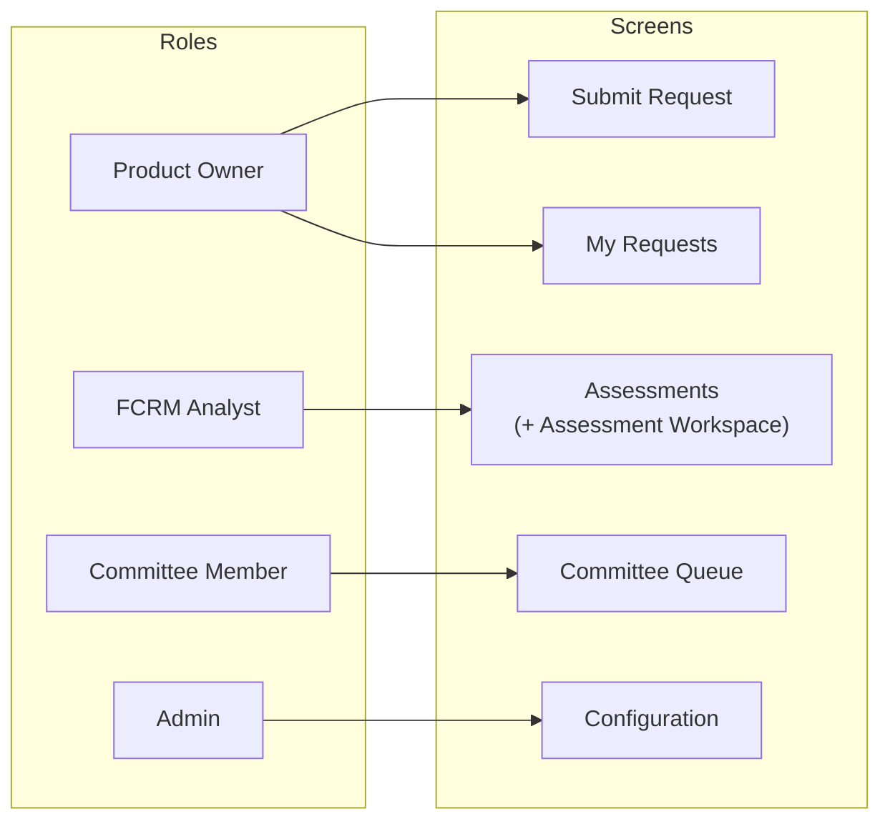
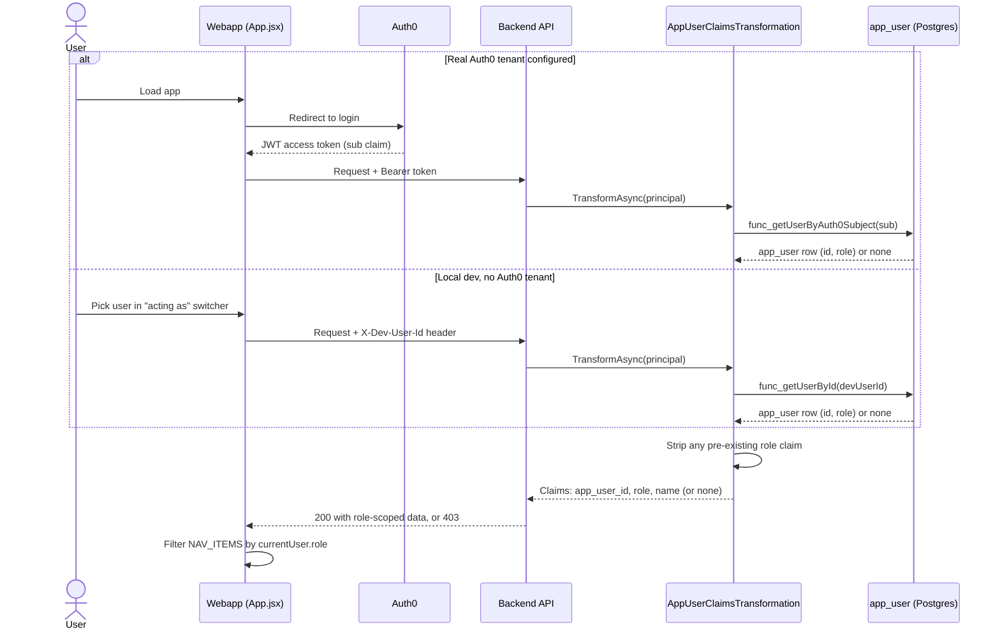
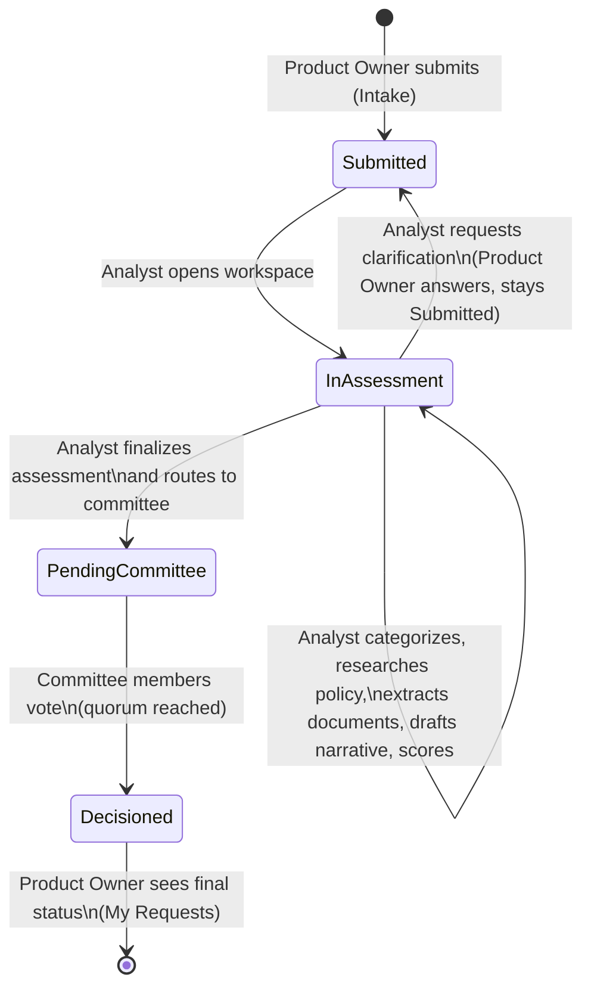

# User Roles and Screens

Companion to [`access-control-matrix.md`](access-control-matrix.md), which maps roles to API
*actions*. This document maps roles to *screens* (the webapp's nav, `App.jsx`), shows how an
end-to-end change request moves across roles, and works through the multi-role user design
question raised below.

**Status: implemented (2026-09-29).** Sections 7–8 were written as a live design discussion before
the team decided; `app_user_role` is now the actual schema (see `schema/003_users.sql`), left as
written below because the reasoning is still the reasoning — only the tense is stale.

## 1. Roles today

Four roles; a user may hold more than one (`app_user_role`, `schema/003_users.sql`,
CHECK-constrained on `role`). Three come
from the original problem statement (`CLAUDE.md`); Admin was added for Epic 10 platform
configuration and kept separate through Epic 11 so the person tuning scoring/workflow rules is
never the person scoring an assessment or voting on it.

| Role | Constant (`AppRoles`) | Purpose |
|---|---|---|
| Product Owner | `ProductOwner` | Raises a change request, tracks its status, answers clarification requests |
| FCRM Analyst | `Analyst` | Categorizes, researches policy, extracts documents, drafts/edits the assessment narrative, scores, finalizes, routes to committee |
| Risk Committee Member | `CommitteeMember` | Reviews a finalized assessment, votes, sees the decision |
| Admin | `Admin` | Owns platform configuration (scoring config, workflow rules) and the user directory — not part of the assessment/voting workflow itself |

## 2. Screens today

`webapp/src/App.jsx`'s `NAV_ITEMS` gates each top-level screen to exactly one role. `Assessment
Workspace` isn't its own nav entry — it's opened from inside Analyst Inbox, so it inherits that
screen's Analyst-only access rather than being separately gated.

| Screen | Component | Nav key | Role | Epic |
|---|---|---|---|---|
| Submit Request | `Intake.jsx` | `intake` | Product Owner | 1 |
| My Requests | `MyRequests.jsx` | `myRequests` | Product Owner | 1 |
| Assessments (inbox) | `AnalystInbox.jsx` | `assessments` | Analyst | 1–7 |
| Assessment Workspace | `AssessmentWorkspace.jsx` | *(drill-in from Assessments)* | Analyst | 2–7, 9 |
| Committee Queue | `CommitteeQueue.jsx` | `committee` | Committee Member | 8 |
| Configuration | `Configuration.jsx` | `configuration` | Admin | 10 |

No screen is currently shared by more than one role — the four roles and the four top-level nav
groups line up 1:1, which is part of why the single-role-per-user model has been enough so far.

## 3. Diagram — role to screen access



## 4. Diagram — how a role is resolved (both identity paths)

Same underlying claims transformation either way; only how the caller's identity is established
before it runs differs. See `access-control-matrix.md`'s "How a role is established" for the prose
version.



## 5. Diagram — change request lifecycle by role

The clearest picture of "how roles use the app together": one change request moving through every
role in sequence. States are `change_request.status` (`schema/004_change_requests.sql`); who
triggers each transition comes straight from `access-control-matrix.md`.



Admin sits outside this flow entirely — it configures scoring/workflow rules that the Analyst and
Committee steps read, but never touches a specific change request. That separation is deliberate
(see `access-control-matrix.md`'s "Four roles, not three").

## 6. The "acting as" switcher — what it actually does today

`DevUserSwitcher` (`App.jsx`) is a **local-development identity simulator**, not a role-preview
tool. It lists every seeded `app_user` row (`GET /api/User`, open only when no Auth0 tenant is
configured) and lets you impersonate any one of them; the choice is sent as `X-Dev-User-Id` and
resolved by `DevBypassAuthHandler` + `AppUserClaimsTransformation` into that row's real role. It
exists only because there's no Auth0 tenant to log into locally — `Program.cs` fails the app at
startup if this path is reachable outside `Development` + no `AUTH0_DOMAIN` + not running in Azure
Container Apps, so it already can't reach a real deployment.

You're right to question it, but it's worth separating two different things it currently does:

1. **Simulating "who am I logged in as"** — a dev-only concern, already fenced off, and it stays
   necessary in some form as long as testing locally without a real per-developer Auth0 login is
   useful.
2. **Standing in for what "role" even means for a user** — this is the part that gets murkier once
   a user can hold more than one role, and is the real subject of the next section.

## 7. Multi-role users

Before this: one `app_user` row, one `role` column, one `ClaimTypes.Role` claim, one string
compared against each screen's allowed-roles list. Decided and built: a user can hold several
roles, and a screen's visibility is driven by whether *any* of a user's roles grants it. Working
through what that touched, layer by layer:

**Data model.** `app_user.role TEXT` (single value) became a join table:
```sql
CREATE TABLE app_user_role (
    user_id UUID NOT NULL REFERENCES app_user(id),
    role TEXT NOT NULL CHECK (role IN ('ProductOwner','Analyst','CommitteeMember','Admin')),
    granted_by_user_id UUID REFERENCES app_user(id), -- null for a seed/system grant
    reason TEXT NOT NULL,
    created_at TIMESTAMPTZ NOT NULL DEFAULT now(),
    PRIMARY KEY (user_id, role)
);
```
A join table over a `TEXT[]` column, because it matches how everything else Admin-owned in this
app is modeled — each grant gets its own actor and reason, auditable the same way `workflow_rule`
and `scoring_config` already are, rather than an opaque array diff. `granted_by_user_id` is
nullable rather than `NOT NULL` — the same convention `audit_event.actor_user_id` uses — so the
initial seed grants (no admin actor exists yet to attribute them to) don't need a bootstrap hack.
`app_user.role` was dropped outright rather than kept as a "primary role" — `app_user_role` is the
only source of truth for access, so there's exactly one place role membership lives.

**Backend authorization — smaller than it looked.** ASP.NET Core's `[Authorize(Roles = "A,B")]`
already OR-matches against *every* role claim a principal carries, not just one. So
`AppUserClaimsTransformation` adding several `ClaimTypes.Role` claims (one per `app_user_role` row)
instead of one was close to a drop-in change — no controller's `[Authorize(Roles = ...)]` attribute
needed to change at all. What did change: `ClaimsPrincipalExtensions.GetAppRole()` (`AppClaims.cs`)
became `GetAppRoles()`, returning the full list; `RequireSelf` was unaffected since it keys off
`app_user_id`, not role.

**Frontend nav.** `NAV_ITEMS.filter(item => item.roles.includes(currentUser.role))` became
`item.roles.some(r => currentUser.roles.includes(r))`, now that `GET /api/User/Me` returns
`roles: string[]` instead of `role: string`. The screens already modeled "which roles may see me"
as a list (`item.roles`); this only changed the user side from one value to a list.

**The switcher itself.** Now that role is a set, the local "acting as" dropdown naturally exercises
multi-role users too — picking a seeded user who holds several roles shows the union of all of
them's screens, no extra UI needed there (`DevUserSwitcher` in `App.jsx` now renders
`displayName — roles.join(', ')`). Went with the additive union for nav visibility, not a
pick-one-"active role"-per-session switcher: given the scale here — four roles, a small team,
currently zero overlap between any two roles' screens — a session-scoped active-role picker would
add a screen and a click with no real payoff yet. Worth revisiting only if a concrete need to
*hide* a screen from a multi-role user shows up.

**Recommendation:** join table for storage (audited like everything else Admin-owned), additive
backend claims, mechanical frontend nav filter, additive (not switchable) screen visibility for
multi-role users. Main tradeoff against a more typical enterprise "pick your active role" pattern:
less realistic if the team ever wants role-scoped *sessions* (e.g., a Committee Member acting in a
audit-only capacity without committee powers active), but meaningfully less to build and test for a
4-role, hackathon-scale app, and it doesn't foreclose adding an active-role switch later if a real
need for it shows up.

## 8. What's still open

The read side of multi-role is fully wired (schema, claims, nav); the write side is not yet built.
`func_getAllUsers`/`func_getUserById`/`func_getUserByAuth0Subject` all return `roles: string[]`,
but there is no `func_grantUserRole`/`func_revokeUserRole` and no Admin UI to call them from — role
grants happen only via seed data or a direct SQL statement today (`seed/seed_dev_users.sql` grants
the six synthetic dev personas their original single role each, plus a seventh synthetic persona
holding all four for local "acting as" testing).

The Admin user-management screen (list/add/edit/deactivate `app_user`, still the confirmed next
build target) is what will need that write path: a multi-select role control per user, backed by
new grant/revoke functions following the mandatory-reason + `audit_event` insert pattern
(`func_upsertWorkflowRule` in `schema/012_configuration.sql` is the template), now that the
single-vs-multi-role question this section worked through is settled.

---

*Diagrams use Mermaid; render in any Mermaid-aware viewer (GitHub, VS Code with a Mermaid
extension, etc.).*
